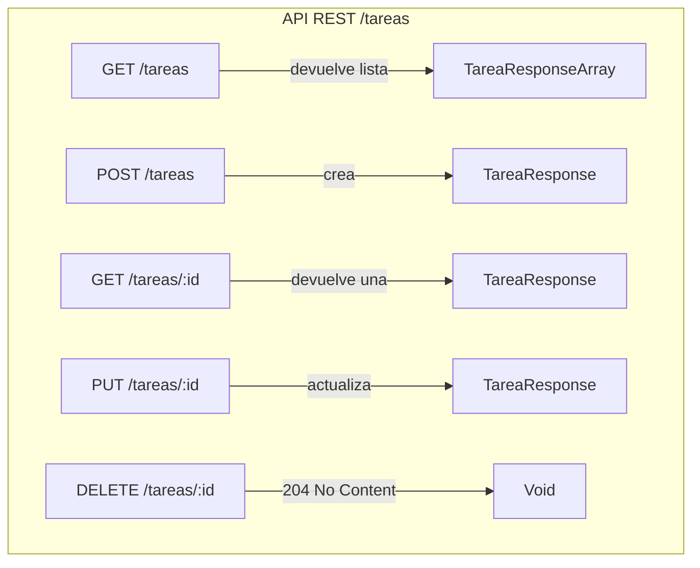

# Semana 3 - Actividad colaborativa: Diseñando una API REST con MVC sin escribir código

!!! info "Duración estimada"
    2 horas presenciales.  
    Modalidad: **trabajo en equipo de 3-4 personas**.

---

## 0. Objetivos de aprendizaje

Al finalizar la actividad el estudiante será capaz de:

1. Describir **qué responsabilidad** le corresponde a cada capa del patrón MVC en una API REST.  
2. Identificar **recursos, endpoints y métodos HTTP** antes de tocar el IDE.  
3. Elaborar un **“contrato” visual** (tablas + diagramas) que sirva como guía para futura implementación.  
4. Argumentar y tomar decisiones de diseño de forma colaborativa.

---

## 1. Ejemplo completo resuelto: *“Gestor de Tareas”*

!!! success "Contexto del ejemplo"
    Una startup necesita una API para que sus aplicaciones web y móvil puedan **crear, listar, actualizar y eliminar tareas** de los usuarios.

---

### 1.1 Análisis de negocio 

| Pregunta clave | Respuesta |
|----------------|-----------|
| ¿Qué es un “recurso”? | Una **tarea** y sus **comentarios**. |
| ¿Atributos mínimos de una tarea? | id, titulo, descripción, fechaVencimiento, estado (PENDIENTE, EN_PROGRESO, COMPLETADA), usuarioId. |
| ¿Relaciones? | Un usuario tiene muchas tareas. Una tarea puede tener muchos comentarios. |

---

### 1.2 Diseño MVC (sin código)

#### 1.2.1 Capas y responsabilidades

| Capa | Responsabilidad en la API | Elementos que diseñamos |
|------|---------------------------|-------------------------|
| **Modelo** | Persistir y reglas de negocio | Entidad *Tarea*, regla “no permitir fecha de vencimiento pasada”, repositorio *TareaRepository*. |
| **Vista** | Representación JSON al cliente | DTO *TareaResponse* (campos que se envían) y *TareaRequest* (campos que recibe). |
| **Controlador** | Orquestar peticiones | *TareaController* con endpoints REST. |

#### 1.2.2 Diagrama de recursos y rutas



#### 1.2.3 Ejemplo de “contrato” (tabla compacta)

| Endpoint | Método | Descripción | Código éxito | Código error ejemplo | Vista (DTO) |
|----------|--------|-------------|--------------|----------------------|-------------|
| `/tareas` | GET | Listar tareas del usuario logueado | 200 OK | 401 Unauthorized | `[{"id":1,"titulo":"Comprar pan",...}]` |
| `/tareas` | POST | Crear nueva tarea | 201 Created + Location | 400 Bad Request | `{"titulo":"Comprar pan","fechaVencimiento":"2024-07-25"}` |
| `/tareas/7` | PUT | Actualizar tarea completa | 200 OK | 404 Not Found | Misma estructura |
| `/tareas/7` | DELETE | Eliminar | 204 No Content | 404 Not Found | — |

---

### 1.3 Reglas de negocio declaradas (sin código)

1. Solo el **propietario** puede modificar o borrar su tarea.  
2. El campo **estado** solo puede pasar de PENDIENTE → EN_PROGRESO → COMPLETADA (sin saltos).  
3. Si la fecha de vencimiento es anterior a “hoy”, rechazar la operación.

---

### 1.4 Entregables del ejemplo (lo que ven los estudiantes)

1. Tabla “Endpoints” (arriba).  
2. Diagrama de secuencia simplificado:  
   ```mermaid
   sequenceDiagram
      Cliente->>+TareaController: POST /tareas
      TareaController->>+TareaService: crear(request)
      TareaService->>TareaService: validarFecha()
      TareaService->>+TareaRepository: save(tarea)
      TareaRepository-->>-TareaService: tareaEntity
      TareaService-->>-TareaController: tareaResponse
      TareaController-->>-Cliente: 201 + Location
   ```
3. Mock de respuesta JSON:
   ```json
   {
     "id": 12,
     "titulo": "Comprar pan",
     "descripcion": "Integral sin sal",
     "fechaVencimiento": "2024-07-25",
     "estado": "PENDIENTE",
     "usuarioId": 5
   }
   ```

---

## 2. Actividad para los equipos

!!! question "Objetivo"
    Replicar el proceso anterior **para un dominio nuevo elegido por el equipo**.

---

### 2.1 Fase 1 – Idear 

Cada equipo **elige una temática diferente** y la anota en la pizarra compartida para evitar duplicados. Ideas sugeridas:

*   Gestor de recetas de cocina  
*   Agenda de mascotas (vacunas, citas)  
*   Reservas de canchas deportivas  
*   Catálogo de películas con puntuación  
*   Sistema de notas rápidas con etiquetas

---

### 2.2 Fase 2 – Análisis de negocio 

Rellenar la siguiente tabla:

| Recurso principal | Atributos mínimos | Relaciones |
|-------------------|-------------------|------------|
| (Ej: Mascota)     | id, nombre, especie, fechaNac, dueñoId | Un dueño tiene muchas mascotas |

---

### 2.3 Fase 3 – Diseño MVC (25 min)

#### A. Capas y responsabilidades
Copiar y completar la plantilla:

| Capa | Responsabilidad | Elemento que diseñamos (nombre) |
|------|-----------------|----------------------------------|
| Modelo | Persistir + reglas | Entidad: ______ , Regla: ______ |
| Vista | JSON de salida | DTO: ______Response |
| Controlador | Endpoints | Clase: ______Controller |

#### B. Tabla de endpoints
Usar la misma estructura que en el ejemplo resuelto (endpoint, método, descripción, códigos, DTO).  
Mínimo **5 endpoints** (incluir GET colección, GET uno, POST, PUT y DELETE).

#### C. Regla de negocio (al menos 3)
Describir en lenguaje natural:  
> “Un dueño solo puede registrar hasta 5 mascotas activas.”

---

### 2.4 Fase 4 – Diagrama de secuencia

Dibujar **un solo flujo clave** (p.ej. “crear mascota”) con el mismo estilo del ejemplo anterior.  
Herramientas: Miro, plantUML en modo texto, o papel.

---

### 2.5 Fase 5 – Presentación y feedback

*   Cada equipo **expone** en 2 min su dominio y tablas.  
*   El resto de la clase **pregunta o sugiere mejoras** (formato 1 pregunta + 1 idea).  
*   Docente anota en una “rúbrica visible” los criterios: claridad, completitud, consistencia REST.

---

## 3. Rúbrica de evaluación rápida (compartida)

| Criterio | Excelente (3) | Bueno (2) | Necesita mejora (1) |
|----------|---------------|-----------|----------------------|
| Identificación correcta de recursos | Recursos claros y bien nombrados | Algunos nombres confusos | Faltan recursos clave |
| Endpoints RESTful | Usan bien verbos y rutas | 1-2 desviaciones | Errores frecuentes |
| Reglas de negocio | Regla lógica y coherente | Simple, pero funciona | No hay regla o es inconsistente |
| Diagrama de secuencia | Flujo lógico y legible | Falta detalle | No coincide con endpoints |

---

## 4. Entrega final (sin código)

Cada equipo **sube al archivo de evidencia** (PDF) con:

1. Tabla de análisis de negocio.  
2. Tabla de endpoints.  
3. Diagrama de secuencia.  
4. Regla de negocio descrita.  


