# Semana 2 - CONCEPTO API REST

---

## **1. API (Interfaz de Programación de Aplicaciones)**

Una **API** es un conjunto de reglas y protocolos que permiten que dos aplicaciones se comuniquen entre sí. En otras palabras, una API define cómo los desarrolladores pueden interactuar con un sistema de software para solicitar servicios o datos.

- **Propósito**: Facilitar la integración entre diferentes sistemas.
- **Ejemplo**: Una aplicación móvil puede usar una API para obtener datos meteorológicos desde un servidor remoto.

---

## **2. Generalidades API WEB**

Las **APIs Web** son un tipo específico de API diseñadas para ser utilizadas a través de la web. Permiten la comunicación entre servidores y clientes (como navegadores web o aplicaciones móviles) mediante el uso de protocolos estándar como HTTP/HTTPS.

- **Características principales**:
  - Basadas en el protocolo HTTP.
  - Permiten operaciones CRUD (Crear, Leer, Actualizar, Eliminar).
  - Usan formatos de datos como JSON o XML.
  - Accesibles desde cualquier dispositivo con conexión a Internet.

---

## **3. REST (Representational State Transfer)**

**REST** es un estilo arquitectónico para sistemas distribuidos, especialmente diseñado para APIs web. No es un protocolo ni un estándar, sino un conjunto de principios y restricciones que guían el diseño de APIs.

- **Principios clave de REST**:
  1. **Sin estado (Stateless)**: Cada solicitud del cliente contiene toda la información necesaria para que el servidor procese la petición.
  2. **Uso de recursos**: Los datos se representan como recursos identificados por URLs.
  3. **Operaciones estándar**: Usa métodos HTTP como GET, POST, PUT, DELETE para realizar operaciones sobre los recursos.
  4. **Formato uniforme**: Los datos se intercambian en formatos estandarizados como JSON o XML.

---

## **4. Métodos HTTP (GET, POST, PUT, DELETE)**

Los **métodos HTTP** son las acciones que se pueden realizar sobre los recursos en una API REST. Los más comunes son:

- **GET**: Solicita datos de un recurso específico. No modifica datos.
  - Ejemplo: Obtener información de un usuario (`GET /users/1`).

- **POST**: Envía datos al servidor para crear un nuevo recurso.
  - Ejemplo: Crear un nuevo usuario (`POST /users`).

- **PUT**: Actualiza un recurso existente o crea uno si no existe.
  - Ejemplo: Actualizar la información de un usuario (`PUT /users/1`).

- **DELETE**: Elimina un recurso específico.
  - Ejemplo: Eliminar un usuario (`DELETE /users/1`).

---

## **5. Endpoints**

Un **endpoint** es la URL específica que representa un recurso en una API REST. Es el punto de entrada donde los clientes envían sus solicitudes.

- **Ejemplo de endpoints**:
  - `https://api.ejemplo.com/users`: Lista de usuarios.
  - `https://api.ejemplo.com/users/1`: Información del usuario con ID 1.
  - `https://api.ejemplo.com/products`: Lista de productos.

---

## **6. Formato JSON**

El **JSON** (JavaScript Object Notation) es un formato ligero para el intercambio de datos. Es ampliamente utilizado en APIs REST debido a su simplicidad y compatibilidad con múltiples lenguajes de programación.

- **Estructura básica**:
  ```json
  {
    "id": 1,
    "nombre": "Juan",
    "edad": 30
  }
  ```
- **Ventajas**:
  - Fácil de leer y escribir tanto para humanos como para máquinas.
  - Compatible con la mayoría de los lenguajes de programación.

---

## **7. Servicio en la nube**

Un **servicio en la nube** es una plataforma que proporciona acceso a recursos informáticos a través de Internet. Las APIs REST a menudo se implementan en servicios en la nube para facilitar la escalabilidad, disponibilidad y accesibilidad global.

### **Ejemplos de servicios en la nube**:
  - AWS (Amazon Web Services)
  - Microsoft Azure
  - Google Cloud Platform

### **Beneficios**:
  - Escalabilidad automática.
  - Reducción de costos operativos.
  - Alta disponibilidad y seguridad.

---

## **8. Clientes REST**

Un **cliente REST** es cualquier aplicación o herramienta que consume una API REST para interactuar con un servidor. Puede ser una aplicación web, móvil o incluso una herramienta de prueba.

- **Herramientas populares para probar APIs REST**:
  - **Postman**: Herramienta gráfica para probar APIs.
  - **cURL**: Herramienta de línea de comandos para realizar solicitudes HTTP.
  - **Insomnia**: Alternativa a Postman para pruebas de APIs.

- **Ejemplo de uso de cURL**:
  ```bash
  curl -X GET https://api.ejemplo.com/users
  ```

Una **API REST** es una interfaz basada en el protocolo HTTP que permite la comunicación entre sistemas mediante el uso de recursos identificados por URLs y métodos HTTP estándar (GET, POST, PUT, DELETE). Los datos generalmente se intercambian en formato JSON, y las APIs REST suelen implementarse en servicios en la nube para garantizar escalabilidad y disponibilidad. Los clientes REST, como Postman o cURL, son herramientas esenciales para probar y consumir estas APIs.


{ align=left }

## **Actividad de clase**

[Ver Actvidad](../assets/pdfs/act1.pdf){ .md-button .md-button--primary }
