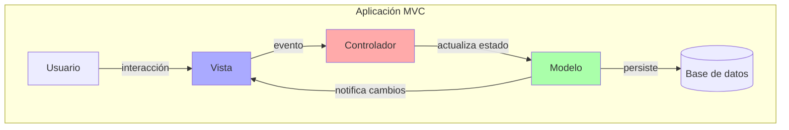
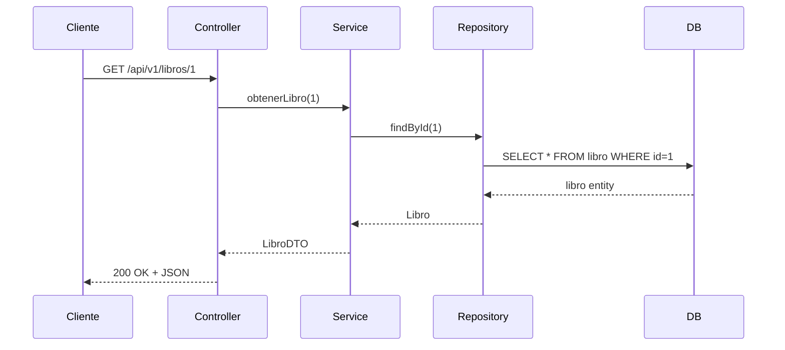
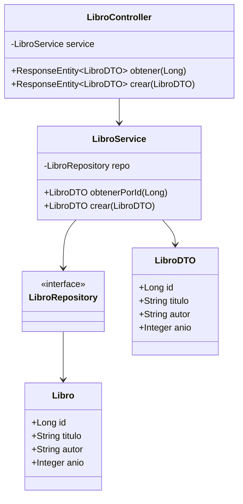
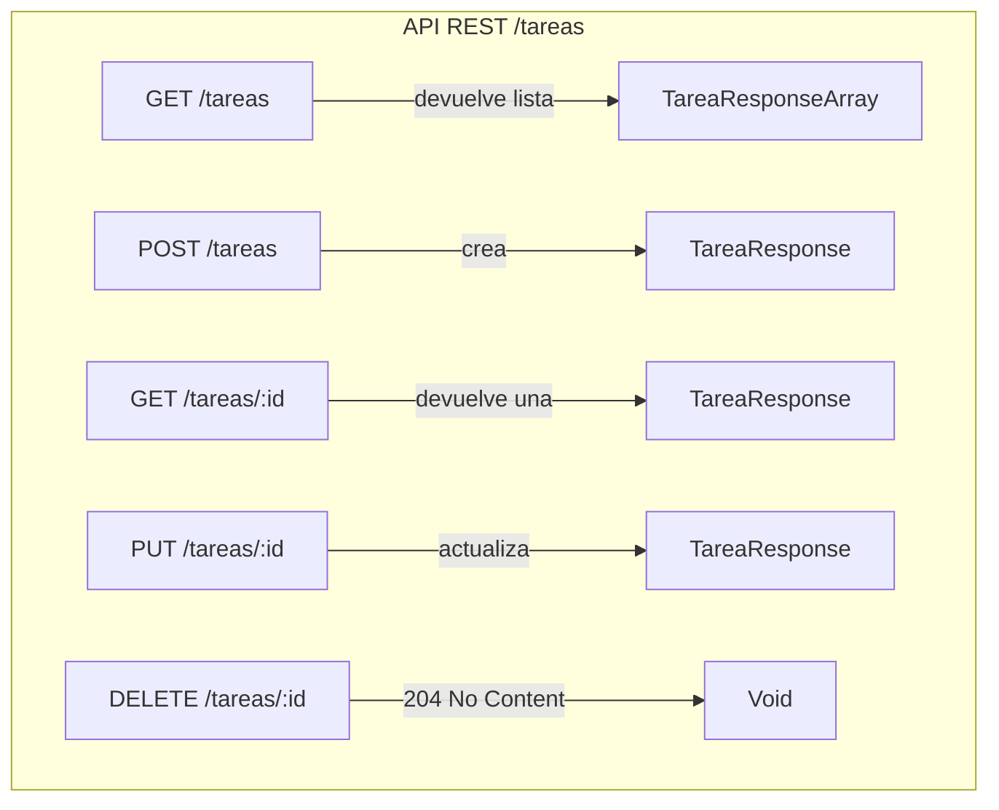

# Semana 3 - Patrones de Diseño: MVC y su aplicación en una API REST con Spring Boot

!!! abstract "Resumen ejecutivo"
    El patrón **Modelo-Vista-Controlador (MVC)** separa responsabilidades en tres capas:  

    *   **Modelo** → datos y lógica de negocio.  
    *   **Vista** → representación al usuario (JSON, HTML, XML, etc.).  
    *   **Controlador** → orquesta las peticiones y respuestas.  

    En una **API REST con Spring Boot** la Vista se reduce a los **DTO/JSON** y los **Controladores REST** (`@RestController`) gestionan el flujo.  
    A continuación veremos la **teoría detallada** con diagramas, código y buenas prácticas.

---

## 1. ¿Qué es un patrón de diseño?

!!! info "Definición"
    Un **patrón de diseño** es una **solución reutilizable** a un problema común en el diseño de software.  

    *   No es código terminado, **es una receta**.  
    *   Mejora la **mantenibilidad, escalabilidad y claridad** del sistema.

---

## 2. Patrón MVC (Modelo-Vista-Controlador)

### 2.1 Origen y propósito
| Año | Autor | Contexto |
|-----|-------|----------|
| **1979** | Trygve Reenskaug | Interfaces de usuario en Smalltalk-80 |
| **Hoy** | Comunidad | Aplicaciones web, móviles, APIs REST |

!!! quote "Objetivo"
    Separar la **interfaz de usuario** (Vista) de la **lógica de negocio** (Modelo) y del **flujo de control** (Controlador).

### 2.2 Diagrama conceptual



### 2.3 Responsabilidades de cada capa

| Capa       | Responsabilidades clave                                                                 | Ejemplo en API REST |
|------------|------------------------------------------------------------------------------------------|---------------------|
| **Modelo** | Entidades JPA, repositorios, servicios, reglas de negocio, validaciones.                | `Libro`, `LibroRepository`, `LibroService` |
| **Vista**  | Representación del recurso: JSON, XML, PDF, etc.                                        | `LibroDTO`, `LibroResponse` |
| **Controlador** | Recibe peticiones HTTP, llama al servicio, devuelve respuesta.                    | `LibroController` (`@RestController`) |

!!! tip "En las APIs REST la Vista NO es HTML, es el **JSON serializado** que Spring genera automáticamente."

---

## 3. MVC dentro de una API REST con Spring Boot

### 3.1 Arquitectura de paquetes recomendada
```
com.miempresa.apirest
├── controller        # ← Capa Controlador
├── service           # ← Lógica de negocio
├── repository        # ← Acceso a datos (JPA)
├── model             # ← Entidades JPA (Modelo)
├── dto               # ← Objetos de transferencia (Vista)
└── config            # ← Configuraciones globales
```

### 3.2 Flujo de una petición REST con MVC



!!! note "Nota"
    La conversión de `Libro` (entidad) a `LibroDTO` se realiza normalmente con MapStruct o un mapper manual.

---

## 4. Implementación paso a paso en Spring Boot

### 4.1 Entidad (Modelo)
```java
package com.miempresa.apirest.model;

import jakarta.persistence.*;

@Entity
@Table(name = "libros")
public class Libro {
    @Id
    @GeneratedValue(strategy = GenerationType.IDENTITY)
    private Long id;

    private String titulo;
    private String autor;
    private Integer anio;

    /* getters y setters */
}
```

### 4.2 Repositorio (Modelo)
```java
package com.miempresa.apirest.repository;

import com.miempresa.apirest.model.Libro;
import org.springframework.data.jpa.repository.JpaRepository;

public interface LibroRepository extends JpaRepository<Libro, Long> {
    // CRUD ya disponible: findAll, findById, save, deleteById...
}
```

### 4.3 DTO (Vista)
```java
package com.miempresa.apirest.dto;

public record LibroDTO(
        Long id,
        String titulo,
        String autor,
        Integer anio
) {}
```

### 4.4 Servicio (Modelo + lógica)
```java
package com.miempresa.apirest.service;

import com.miempresa.apirest.dto.LibroDTO;
import com.miempresa.apirest.model.Libro;
import com.miempresa.apirest.repository.LibroRepository;
import org.springframework.stereotype.Service;

@Service
public class LibroService {
    private final LibroRepository repo;

    public LibroService(LibroRepository repo) {
        this.repo = repo;
    }

    public LibroDTO obtenerPorId(Long id) {
        return repo.findById(id)
                   .map(this::toDto)
                   .orElseThrow(() -> new LibroNoEncontradoException(id));
    }

    private LibroDTO toDto(Libro l) {
        return new LibroDTO(l.getId(), l.getTitulo(), l.getAutor(), l.getAnio());
    }
}
```

### 4.5 Controlador REST (Controlador)
```java
package com.miempresa.apirest.controller;

import com.miempresa.apirest.dto.LibroDTO;
import com.miempresa.apirest.service.LibroService;
import org.springframework.http.ResponseEntity;
import org.springframework.web.bind.annotation.*;

@RestController
@RequestMapping("/api/v1/libros")
public class LibroController {

    private final LibroService service;

    public LibroController(LibroService service) {
        this.service = service;
    }

    @GetMapping("/{id}")
    public ResponseEntity<LibroDTO> obtener(@PathVariable Long id) {
        LibroDTO dto = service.obtenerPorId(id);
        return ResponseEntity.ok(dto);
    }

    @PostMapping
    public ResponseEntity<LibroDTO> crear(@RequestBody LibroDTO dto) {
        LibroDTO nuevo = service.crear(dto);
        return ResponseEntity
                .created(URI.create("/api/v1/libros/" + nuevo.id()))
                .body(nuevo);
    }

    @PutMapping("/{id}")
    public LibroDTO actualizar(@PathVariable Long id, @RequestBody LibroDTO dto) {
        return service.actualizar(id, dto);
    }

    @DeleteMapping("/{id}")
    public ResponseEntity<Void> eliminar(@PathVariable Long id) {
        service.eliminar(id);
        return ResponseEntity.noContent().build();
    }
}
```

---

## 5. Diagrama de clases simplificado



---

## 6. Buenas prácticas y errores comunes

| Buena práctica                                    | Ejemplo concreto                                           |
|---------------------------------------------------|------------------------------------------------------------|
| **No exponer entidades JPA**                      | Usar siempre DTOs (`LibroDTO`).                            |
| **Validaciones**                                  | `@NotBlank`, `@Size`, `@Valid` en el DTO.                  |
| **Manejo global de excepciones**                  | `@ControllerAdvice` + `@ExceptionHandler`.                 |
| **Paginación**                                    | `Pageable` de Spring Data.                                 |
| **Logging**                                       | SLF4J + `@Slf4j` (Lombok).                                 |
| **Tests**                                         | `@WebMvcTest`, `@DataJpaTest`, Testcontainers.             |

!!! failure "Errores comunes"
    *   Devolver la entidad JPA directamente → exposición de datos sensibles o lazily loaded.  
    *   Colocar lógica de negocio en el controlador → acoplamiento y dificultad de test.  
    *   Ignorar el versionado de API → romper a los clientes antiguos.

---

## 7. Extensión: MVC vs MVVM vs MVP

| Patrón | Vista | Intermediario | Caso de uso típico |
|--------|-------|---------------|--------------------|
| MVC    | HTML/JSON | Controlador | APIs REST, monolitos web |
| MVP    | Android View | Presenter | Android nativo |
| MVVM   | WPF/Angular | ViewModel | SPA reactivas, WPF |

---

## 8. Recursos adicionales

*   [Spring Guides – Building a RESTful Web Service](https://spring.io/guides/gs/rest-service/)  
*   [Spring Data JPA Reference](https://docs.spring.io/spring-data/jpa/reference/)  
*   [MapStruct – Mapeo automático de DTOs](https://mapstruct.org)  
*   [OpenAPI 3 + Springdoc](https://springdoc.org) – Documentación automática.


## Actividad colaborativa: Diseñando una API REST con MVC sin escribir código

!!! info "Duración estimada"
    2 horas presenciales.  
    Modalidad: **trabajo en equipo de 3-4 personas**.

---

## 0. Objetivos de aprendizaje

Al finalizar la actividad el estudiante será capaz de:

1. Describir **qué responsabilidad** le corresponde a cada capa del patrón MVC en una API REST.  
2. Identificar **recursos, endpoints y métodos HTTP** antes de tocar el IDE.  
3. Elaborar un **“contrato” visual** (tablas + diagramas) que sirva como guía para futura implementación.  
4. Argumentar y tomar decisiones de diseño de forma colaborativa.

---

## 1. Ejemplo completo resuelto: *“Gestor de Tareas”*

!!! success "Contexto del ejemplo"
    Una startup necesita una API para que sus aplicaciones web y móvil puedan **crear, listar, actualizar y eliminar tareas** de los usuarios.

---

### 1.1 Análisis de negocio 

| Pregunta clave | Respuesta |
|----------------|-----------|
| ¿Qué es un “recurso”? | Una **tarea** y sus **comentarios**. |
| ¿Atributos mínimos de una tarea? | id, titulo, descripción, fechaVencimiento, estado (PENDIENTE, EN_PROGRESO, COMPLETADA), usuarioId. |
| ¿Relaciones? | Un usuario tiene muchas tareas. Una tarea puede tener muchos comentarios. |

---

### 1.2 Diseño MVC (sin código)

#### 1.2.1 Capas y responsabilidades

| Capa | Responsabilidad en la API | Elementos que diseñamos |
|------|---------------------------|-------------------------|
| **Modelo** | Persistir y reglas de negocio | Entidad *Tarea*, regla “no permitir fecha de vencimiento pasada”, repositorio *TareaRepository*. |
| **Vista** | Representación JSON al cliente | DTO *TareaResponse* (campos que se envían) y *TareaRequest* (campos que recibe). |
| **Controlador** | Orquestar peticiones | *TareaController* con endpoints REST. |

#### 1.2.2 Diagrama de recursos y rutas



#### 1.2.3 Ejemplo de “contrato” (tabla compacta)

| Endpoint | Método | Descripción | Código éxito | Código error ejemplo | Vista (DTO) |
|----------|--------|-------------|--------------|----------------------|-------------|
| `/tareas` | GET | Listar tareas del usuario logueado | 200 OK | 401 Unauthorized | `[{"id":1,"titulo":"Comprar pan",...}]` |
| `/tareas` | POST | Crear nueva tarea | 201 Created + Location | 400 Bad Request | `{"titulo":"Comprar pan","fechaVencimiento":"2024-07-25"}` |
| `/tareas/7` | PUT | Actualizar tarea completa | 200 OK | 404 Not Found | Misma estructura |
| `/tareas/7` | DELETE | Eliminar | 204 No Content | 404 Not Found | — |

---

### 1.3 Reglas de negocio declaradas (sin código)

1. Solo el **propietario** puede modificar o borrar su tarea.  
2. El campo **estado** solo puede pasar de PENDIENTE → EN_PROGRESO → COMPLETADA (sin saltos).  
3. Si la fecha de vencimiento es anterior a “hoy”, rechazar la operación.

---

### 1.4 Entregables del ejemplo (lo que ven los estudiantes)

1. Tabla “Endpoints” (arriba).  
2. Diagrama de secuencia simplificado:  
   ```mermaid
   sequenceDiagram
      Cliente->>+TareaController: POST /tareas
      TareaController->>+TareaService: crear(request)
      TareaService->>TareaService: validarFecha()
      TareaService->>+TareaRepository: save(tarea)
      TareaRepository-->>-TareaService: tareaEntity
      TareaService-->>-TareaController: tareaResponse
      TareaController-->>-Cliente: 201 + Location
   ```
3. Mock de respuesta JSON:
   ```json
   {
     "id": 12,
     "titulo": "Comprar pan",
     "descripcion": "Integral sin sal",
     "fechaVencimiento": "2024-07-25",
     "estado": "PENDIENTE",
     "usuarioId": 5
   }
   ```

---

## 2. Actividad para los equipos

!!! question "Objetivo"
    Replicar el proceso anterior **para un dominio nuevo elegido por el equipo**.

---

### 2.1 Fase 1 – Idear 

Cada equipo **elige una temática diferente** y la anota en la pizarra compartida para evitar duplicados. Ideas sugeridas:

*   Gestor de recetas de cocina  
*   Agenda de mascotas (vacunas, citas)  
*   Reservas de canchas deportivas  
*   Catálogo de películas con puntuación  
*   Sistema de notas rápidas con etiquetas

---

### 2.2 Fase 2 – Análisis de negocio 

Rellenar la siguiente tabla:

| Recurso principal | Atributos mínimos | Relaciones |
|-------------------|-------------------|------------|
| (Ej: Mascota)     | id, nombre, especie, fechaNac, dueñoId | Un dueño tiene muchas mascotas |

---

### 2.3 Fase 3 – Diseño MVC (25 min)

#### A. Capas y responsabilidades
Copiar y completar la plantilla:

| Capa | Responsabilidad | Elemento que diseñamos (nombre) |
|------|-----------------|----------------------------------|
| Modelo | Persistir + reglas | Entidad: ______ , Regla: ______ |
| Vista | JSON de salida | DTO: ______Response |
| Controlador | Endpoints | Clase: ______Controller |

#### B. Tabla de endpoints
Usar la misma estructura que en el ejemplo resuelto (endpoint, método, descripción, códigos, DTO).  
Mínimo **5 endpoints** (incluir GET colección, GET uno, POST, PUT y DELETE).

#### C. Regla de negocio (al menos 3)
Describir en lenguaje natural:  
> “Un dueño solo puede registrar hasta 5 mascotas activas.”

---

### 2.4 Fase 4 – Diagrama de secuencia

Dibujar **un solo flujo clave** (p.ej. “crear mascota”) con el mismo estilo del ejemplo anterior.  
Herramientas: Miro, plantUML en modo texto, o papel.

---

### 2.5 Fase 5 – Presentación y feedback

*   Cada equipo **expone** en 2 min su dominio y tablas.  
*   El resto de la clase **pregunta o sugiere mejoras** (formato 1 pregunta + 1 idea).  
*   Docente anota en una “rúbrica visible” los criterios: claridad, completitud, consistencia REST.

---

## 3. Rúbrica de evaluación rápida (compartida)

| Criterio | Excelente (3) | Bueno (2) | Necesita mejora (1) |
|----------|---------------|-----------|----------------------|
| Identificación correcta de recursos | Recursos claros y bien nombrados | Algunos nombres confusos | Faltan recursos clave |
| Endpoints RESTful | Usan bien verbos y rutas | 1-2 desviaciones | Errores frecuentes |
| Reglas de negocio | Regla lógica y coherente | Simple, pero funciona | No hay regla o es inconsistente |
| Diagrama de secuencia | Flujo lógico y legible | Falta detalle | No coincide con endpoints |

---

## 4. Entrega final (sin código)

Cada equipo **sube al archivo de evidencia** (PDF) con:

1. Tabla de análisis de negocio.  
2. Tabla de endpoints.  
3. Diagrama de secuencia.  
4. Regla de negocio descrita.  


