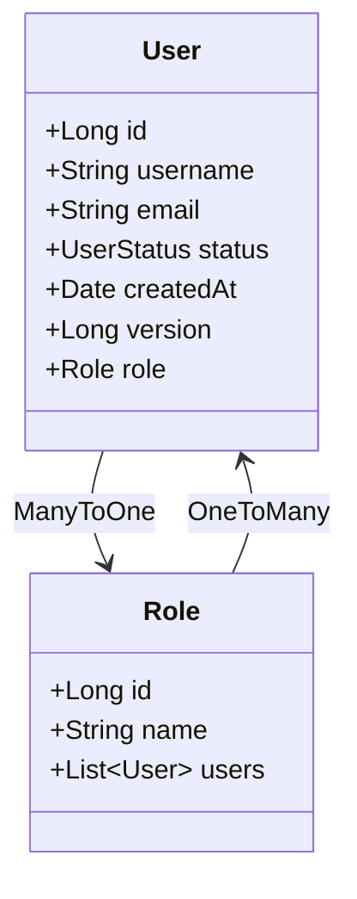
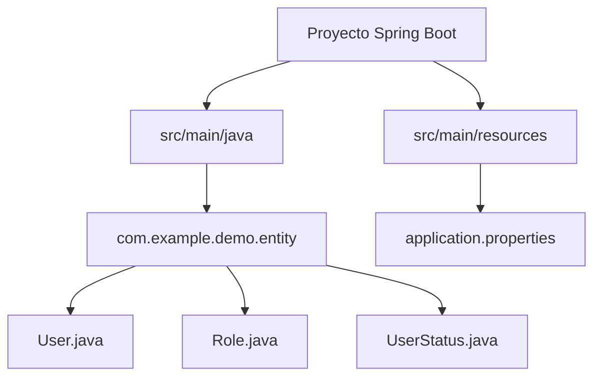

#  Semana 5 - Entidades en Spring Boot

!!! info "Introducción"
    Las **entidades** en Spring Boot son clases Java que representan tablas en una base de datos relacional, típicamente utilizadas con **JPA (Java Persistence API)** y frameworks como **Hibernate**. Estas clases mapean objetos Java a registros de base de datos, permitiendo operaciones CRUD (Crear, Leer, Actualizar, Eliminar) de manera sencilla. En esta guía, exploraremos las anotaciones más comunes de JPA, su propósito, y proporcionaremos un ejemplo completo de una entidad, acompañado de diagramas generados con **Mermaid** para ilustrar relaciones y estructura.

## ¿Qué es una Entidad en Spring Boot?

Una entidad en Spring Boot es una clase Java anotada con `@Entity`, que indica que la clase está mapeada a una tabla en la base de datos. Cada instancia de la entidad corresponde a una fila en la tabla, y los atributos de la clase representan columnas. Las entidades son fundamentales en aplicaciones que utilizan **Spring Data JPA** para interactuar con bases de datos relacionales.

### Características Principales
- **Mapeo Objeto-Relacional (ORM):** Las entidades permiten trabajar con objetos Java en lugar de consultas SQL directas.
- **Anotaciones JPA:** Proporcionan metadatos para definir cómo se mapea la clase a la base de datos.
- **Relaciones:** Las entidades pueden tener relaciones como uno a uno, uno a muchos, o muchos a muchos, definidas mediante anotaciones específicas.

## Anotaciones Comunes en Entidades

A continuación, se detallan las anotaciones más utilizadas en entidades de Spring Boot con JPA, junto con su propósito y ejemplos prácticos.

### 1. `@Entity`
- **Propósito:** Indica que la clase es una entidad JPA y está mapeada a una tabla en la base de datos.
- **Uso:** Se coloca encima de la clase.
- **Detalles:** La tabla en la base de datos tendrá el mismo nombre que la clase, a menos que se especifique otro nombre con `@Table`.
- **Ejemplo:**
  ```java
  @Entity
  public class User {
      // Atributos y métodos
  }
  ```

### 2. `@Table`
- **Propósito:** Especifica el nombre de la tabla en la base de datos asociada con la entidad. También permite definir esquemas, índices, o restricciones.
- **Uso:** Opcional, usado si el nombre de la tabla difiere del nombre de la clase.
- **Ejemplo:**
  ```java
  @Entity
  @Table(name = "users", schema = "public")
  public class User {
      // Atributos y métodos
  }
  ```

### 3. `@Id`
- **Propósito:** Marca un atributo como la clave primaria de la entidad.
- **Uso:** Obligatorio en cada entidad para identificar de manera única cada registro.
- **Ejemplo:**
  ```java
  @Id
  private Long id;
  ```

### 4. `@GeneratedValue`
- **Propósito:** Define la estrategia para generar valores de la clave primaria automáticamente.
- **Estrategias Comunes:**
  - `GenerationType.AUTO`: El proveedor de persistencia (como Hibernate) elige la estrategia más adecuada.
  - `GenerationType.IDENTITY`: Usa una columna de identidad en la base de datos (como `SERIAL` en PostgreSQL).
  - `GenerationType.SEQUENCE`: Usa una secuencia de base de datos.
  - `GenerationType.TABLE`: Usa una tabla auxiliar para generar IDs.
- **Ejemplo:**
  ```java
  @Id
  @GeneratedValue(strategy = GenerationType.IDENTITY)
  private Long id;
  ```

### 5. `@Column`
- **Propósito:** Personaliza el mapeo de un atributo a una columna en la base de datos.
- **Atributos Comunes:**
  - `name`: Nombre de la columna en la base de datos.
  - `nullable`: Indica si la columna permite valores nulos (`true` o `false`).
  - `length`: Define la longitud máxima para columnas de tipo cadena.
  - `unique`: Indica si los valores de la columna deben ser únicos.
- **Ejemplo:**
  ```java
  @Column(name = "email_address", nullable = false, unique = true, length = 100)
  private String email;
  ```

### 6. `@ManyToOne`, `@OneToMany`, `@OneToOne`, `@ManyToMany`
- **Propósito:** Definen relaciones entre entidades.
- **Detalles:**
  - `@ManyToOne`: Indica una relación de muchos a uno (ejemplo: muchos usuarios pertenecen a un rol).
  - `@OneToMany`: Indica una relación de uno a muchos (ejemplo: un usuario tiene muchas órdenes).
  - `@OneToOne`: Indica una relación de uno a uno (ejemplo: un usuario tiene un perfil).
  - `@ManyToMany`: Indica una relación de muchos a muchos (ejemplo: estudiantes y cursos).
- **Ejemplo (`@ManyToOne`):**
  ```java
  @ManyToOne
  @JoinColumn(name = "role_id")
  private Role role;
  ```
- **Ejemplo (`@OneToMany`):**
  ```java
  @OneToMany(mappedBy = "user")
  private List<Order> orders;
  ```

### 7. `@JoinColumn`
- **Propósito:** Especifica la columna de la base de datos que actúa como clave foránea en una relación.
- **Uso:** Comúnmente usado con `@ManyToOne` o `@OneToOne` para definir el nombre de la columna foránea.
- **Ejemplo:**
  ```java
  @ManyToOne
  @JoinColumn(name = "role_id", nullable = false)
  private Role role;
  ```

### 8. `@Enumerated`
- **Propósito:** Mapea un campo de tipo `Enum` a una columna en la base de datos.
- **Valores:**
  - `EnumType.STRING`: Almacena el nombre del valor del enum.
  - `EnumType.ORDINAL`: Almacena el índice del valor del enum.
- **Ejemplo:**
  ```java
  @Enumerated(EnumType.STRING)
  @Column(name = "status")
  private UserStatus status;
  ```

### 9. `@Temporal`
- **Propósito:** Especifica el tipo de datos temporal para campos de tipo `Date` o `Calendar`.
- **Valores:**
  - `TemporalType.DATE`: Solo fecha.
  - `TemporalType.TIME`: Solo hora.
  - `TemporalType.TIMESTAMP`: Fecha y hora.
- **Ejemplo:**
  ```java
  @Temporal(TemporalType.TIMESTAMP)
  @Column(name = "created_at")
  private Date createdAt;
  ```

### 10. `@Transient`
- **Propósito:** Indica que un atributo no debe ser persistido en la base de datos.
- **Uso:** Útil para campos calculados o temporales.
- **Ejemplo:**
  ```java
  @Transient
  private String temporaryToken;
  ```

### 11. `@Version`
- **Propósito:** Habilita el control de versiones para manejar concurrencia optimista.
- **Uso:** Cada vez que se actualiza la entidad, el valor de la versión se incrementa.
- **Ejemplo:**
  ```java
  @Version
  private Long version;
  ```

## Ejemplo Completo: Entidad `User` y `Role`

A continuación, se presenta un ejemplo completo de dos entidades relacionadas: `User` y `Role`, con todas las anotaciones explicadas.

### Diagrama de Relaciones
A continuación, se muestra un diagrama Mermaid que ilustra la relación entre las entidades `User` y `Role`.



### Código de la Entidad `User`

```java
package com.example.demo.entity;

import jakarta.persistence.*;
import java.util.Date;

@Entity
@Table(name = "users")
public class User {

    @Id
    @GeneratedValue(strategy = GenerationType.IDENTITY)
    private Long id;

    @Column(name = "username", nullable = false, length = 50)
    private String username;

    @Column(name = "email_address", nullable = false, unique = true, length = 100)
    private String email;

    @Enumerated(EnumType.STRING)
    @Column(name = "status", nullable = false)
    private UserStatus status;

    @Temporal(TemporalType.TIMESTAMP)
    @Column(name = "created_at", nullable = false)
    private Date createdAt;

    @Version
    private Long version;

    @ManyToOne
    @JoinColumn(name = "role_id", nullable = false)
    private Role role;

    @Transient
    private String temporaryToken;

    // Constructores, getters y setters
    public User() {}

    public User(String username, String email, UserStatus status, Date createdAt, Role role) {
        this.username = username;
        this.email = email;
        this.status = status;
        this.createdAt = createdAt;
        this.role = role;
    }

    // Getters y setters omitidos por brevedad
}
```

### Código de la Entidad `Role`

```java
package com.example.demo.entity;

import jakarta.persistence.*;
import java.util.List;

@Entity
@Table(name = "roles")
public class Role {

    @Id
    @GeneratedValue(strategy = GenerationType.IDENTITY)
    private Long id;

    @Column(name = "name", nullable = false, length = 50)
    private String name;

    @OneToMany(mappedBy = "role")
    private List<User> users;

    // Constructores, getters y setters
    public Role() {}

    public Role(String name) {
        this.name = name;
    }

    // Getters y setters omitidos por brevedad
}
```

### Código del Enum `UserStatus`

```java
package com.example.demo.entity;

public enum UserStatus {
    ACTIVE,
    INACTIVE,
    SUSPENDED
}
```

## Configuración en Spring Boot

Para que las entidades funcionen, necesitas configurar Spring Data JPA en tu proyecto. A continuación, un ejemplo de configuración básica en el archivo `application.properties`:

```properties
spring.datasource.url=jdbc:postgresql://localhost:5432/mydb
spring.datasource.username=postgres
spring.datasource.password=secret
spring.jpa.hibernate.ddl-auto=update
spring.jpa.show-sql=true
spring.jpa.properties.hibernate.dialect=org.hibernate.dialect.PostgreSQLDialect
```

### Explicación de la Configuración
- `spring.datasource.url`: URL de conexión a la base de datos.
- `spring.datasource.username` y `password`: Credenciales de la base de datos.
- `spring.jpa.hibernate.ddl-auto=update`: Hibernate crea o actualiza las tablas basadas en las entidades.
- `spring.jpa.show-sql=true`: Muestra las consultas SQL generadas.
- `spring.jpa.properties.hibernate.dialect`: Dialecto de la base de datos (en este caso, PostgreSQL).

## Diagrama de Estructura del Proyecto



