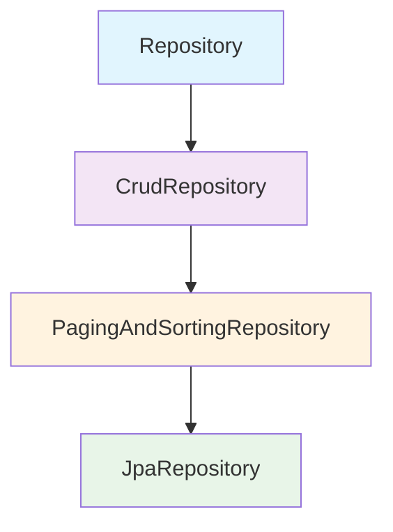

# Semana 8 - Repositorios en Spring Boot (Spring Data JPA)

!!! abstract "Resumen ejecutivo"
    Los **repositorios** en Spring Boot son interfaces que proporcionan métodos para realizar operaciones CRUD (Create, Read, Update, Delete) sobre las entidades sin necesidad de escribir código SQL. Spring Data JPA genera automáticamente la implementación basándose en convenciones de nombres y anotaciones.

---

## 1. ¿Qué es un repositorio en Spring Boot?

!!! info "Definición"
    Un **repositorio** es una interfaz que actúa como una capa de abstracción entre la lógica de negocio y la base de datos. Proporciona métodos para acceder y manipular datos de las entidades de forma sencilla y eficiente.

### 1.1 Ventajas de usar repositorios

| Ventaja | Descripción |
|---------|-------------|
| **Abstracción** | Oculta la complejidad de las consultas SQL |
| **Productividad** | Reduce significativamente el código boilerplate |
| **Mantenibilidad** | Centraliza las operaciones de datos |
| **Testabilidad** | Facilita las pruebas unitarias con mocks |
| **Consistencia** | Estandariza el acceso a datos en toda la aplicación |

---

## 2. Jerarquía de interfaces de repositorio

Spring Data JPA proporciona una jerarquía de interfaces con diferentes niveles de funcionalidad:



### 2.1 Descripción de cada interfaz

#### `Repository<T, ID>`
- **Propósito**: Interfaz marcadora base
- **Métodos**: Ninguno (solo marcador)
- **Uso**: Cuando quieres crear métodos completamente personalizados

#### `CrudRepository<T, ID>`
- **Propósito**: Operaciones CRUD básicas
- **Métodos principales**:
  ```java
  save(S entity)           // Guardar entidad
  findById(ID id)          // Buscar por ID
  findAll()                // Obtener todas las entidades
  deleteById(ID id)        // Eliminar por ID
  count()                  // Contar registros
  existsById(ID id)        // Verificar existencia
  ```

#### `PagingAndSortingRepository<T, ID>`
- **Propósito**: Añade paginación y ordenamiento
- **Métodos adicionales**:
  ```java
  findAll(Sort sort)           // Buscar con ordenamiento
  findAll(Pageable pageable)   // Buscar con paginación
  ```

#### `JpaRepository<T, ID>`
- **Propósito**: Funcionalidad completa de JPA
- **Métodos adicionales**:
  ```java
  flush()                      // Sincronizar con BD
  saveAndFlush(S entity)       // Guardar y sincronizar
  deleteInBatch(Iterable<T>)   // Eliminación en lote
  getOne(ID id)                // Referencia lazy
  ```

---

## 3. Creando tu primer repositorio

### 3.1 Ejemplo práctico: Entidad Producto

Primero, definamos una entidad simple:

```java
package com.ejemplo.demo.entity;

import jakarta.persistence.*;
import lombok.Data;
import lombok.NoArgsConstructor;
import lombok.AllArgsConstructor;

import java.math.BigDecimal;
import java.time.LocalDateTime;

@Entity
@Table(name = "productos")
@Data
@NoArgsConstructor
@AllArgsConstructor
public class Producto {
    
    @Id
    @GeneratedValue(strategy = GenerationType.IDENTITY)
    private Long id;
    
    @Column(nullable = false, length = 100)
    private String nombre;
    
    @Column(columnDefinition = "TEXT")
    private String descripcion;
    
    @Column(nullable = false, precision = 10, scale = 2)
    private BigDecimal precio;
    
    @Column(nullable = false)
    private Integer stock;
    
    @Column(nullable = false)
    private Boolean activo = true;
    
    @Column(name = "fecha_creacion", nullable = false)
    private LocalDateTime fechaCreacion;
    
    @PrePersist
    protected void onCreate() {
        fechaCreacion = LocalDateTime.now();
    }
}
```

### 3.2 Repositorio básico

```java
package com.ejemplo.demo.repository;

import com.ejemplo.demo.entity.Producto;
import org.springframework.data.jpa.repository.JpaRepository;
import org.springframework.stereotype.Repository;

@Repository
public interface ProductoRepository extends JpaRepository<Producto, Long> {
    // Spring Data JPA genera automáticamente la implementación
    // Ya tienes disponibles todos los métodos CRUD
}
```

### 3.3 Usando el repositorio en un servicio

```java
package com.ejemplo.demo.service;

import com.ejemplo.demo.entity.Producto;
import com.ejemplo.demo.repository.ProductoRepository;
import org.springframework.beans.factory.annotation.Autowired;
import org.springframework.stereotype.Service;

import java.util.List;
import java.util.Optional;

@Service
public class ProductoService {
    
    @Autowired
    private ProductoRepository productoRepository;
    
    // Crear producto
    public Producto crearProducto(Producto producto) {
        return productoRepository.save(producto);
    }
    
    // Obtener todos los productos
    public List<Producto> obtenerTodos() {
        return productoRepository.findAll();
    }
    
    // Buscar por ID
    public Optional<Producto> buscarPorId(Long id) {
        return productoRepository.findById(id);
    }
    
    // Actualizar producto
    public Producto actualizarProducto(Producto producto) {
        return productoRepository.save(producto);
    }
    
    // Eliminar producto
    public void eliminarProducto(Long id) {
        productoRepository.deleteById(id);
    }
    
    // Contar productos
    public long contarProductos() {
        return productoRepository.count();
    }
}
```

---

## 4. Métodos de consulta derivados (Query Methods)

!!! tip "Convención sobre configuración"
    Spring Data JPA puede generar consultas automáticamente basándose en el nombre del método. Esto elimina la necesidad de escribir SQL en muchos casos.

### 4.1 Palabras clave para nombres de métodos

| Palabra clave | Ejemplo | SQL equivalente |
|---------------|---------|----------------|
| `findBy` | `findByNombre(String nombre)` | `WHERE nombre = ?` |
| `findAllBy` | `findAllByActivo(Boolean activo)` | `WHERE activo = ?` |
| `countBy` | `countByActivo(Boolean activo)` | `SELECT COUNT(*) WHERE activo = ?` |
| `deleteBy` | `deleteByActivo(Boolean activo)` | `DELETE WHERE activo = ?` |
| `existsBy` | `existsByNombre(String nombre)` | `SELECT COUNT(*) > 0 WHERE nombre = ?` |

### 4.2 Operadores de comparación

```java
@Repository
public interface ProductoRepository extends JpaRepository<Producto, Long> {
    
    // Igualdad
    List<Producto> findByNombre(String nombre);
    
    // Múltiples condiciones con AND
    List<Producto> findByNombreAndActivo(String nombre, Boolean activo);
    
    // Múltiples condiciones con OR
    List<Producto> findByNombreOrDescripcion(String nombre, String descripcion);
    
    // Mayor que
    List<Producto> findByPrecioGreaterThan(BigDecimal precio);
    
    // Menor que
    List<Producto> findByPrecioLessThan(BigDecimal precio);
    
    // Entre valores
    List<Producto> findByPrecioBetween(BigDecimal min, BigDecimal max);
    
    // Contiene texto (LIKE %texto%)
    List<Producto> findByNombreContaining(String texto);
    
    // Empieza con texto (LIKE texto%)
    List<Producto> findByNombreStartingWith(String prefijo);
    
    // Termina con texto (LIKE %texto)
    List<Producto> findByNombreEndingWith(String sufijo);
    
    // Ignorar mayúsculas/minúsculas
    List<Producto> findByNombreIgnoreCase(String nombre);
    
    // Valores nulos
    List<Producto> findByDescripcionIsNull();
    List<Producto> findByDescripcionIsNotNull();
    
    // En una lista de valores
    List<Producto> findByNombreIn(List<String> nombres);
    
    // Ordenamiento
    List<Producto> findByActivoOrderByNombreAsc(Boolean activo);
    List<Producto> findByActivoOrderByPrecioDesc(Boolean activo);
    
    // Limitar resultados
    List<Producto> findTop5ByActivoOrderByFechaCreacionDesc(Boolean activo);
    Producto findFirstByActivoOrderByPrecioAsc(Boolean activo);
}
```

### 4.3 Ejemplo de uso en el servicio

```java
@Service
public class ProductoService {
    
    @Autowired
    private ProductoRepository productoRepository;
    
    // Buscar productos activos
    public List<Producto> obtenerProductosActivos() {
        return productoRepository.findByActivo(true);
    }
    
    // Buscar por rango de precios
    public List<Producto> buscarPorRangoPrecios(BigDecimal min, BigDecimal max) {
        return productoRepository.findByPrecioBetween(min, max);
    }
    
    // Buscar productos por texto en nombre
    public List<Producto> buscarPorTexto(String texto) {
        return productoRepository.findByNombreContaining(texto);
    }
    
    // Obtener productos más caros
    public List<Producto> obtenerMasCaros() {
        return productoRepository.findTop5ByActivoOrderByPrecioDesc(true);
    }
}
```

---

## 5. Consultas personalizadas con @Query

Cuando los métodos derivados no son suficientes, puedes escribir consultas personalizadas:

### 5.1 Consultas JPQL

```java
@Repository
public interface ProductoRepository extends JpaRepository<Producto, Long> {
    
    // JPQL básico
    @Query("SELECT p FROM Producto p WHERE p.precio > :precio")
    List<Producto> findProductosCaros(@Param("precio") BigDecimal precio);
    
    // JPQL con múltiples parámetros
    @Query("SELECT p FROM Producto p WHERE p.nombre LIKE %:nombre% AND p.activo = :activo")
    List<Producto> buscarPorNombreYEstado(@Param("nombre") String nombre, 
                                         @Param("activo") Boolean activo);
    
    // Consulta de agregación
    @Query("SELECT AVG(p.precio) FROM Producto p WHERE p.activo = true")
    BigDecimal obtenerPrecioPromedio();
    
    // Consulta que retorna valores específicos
    @Query("SELECT p.nombre, p.precio FROM Producto p WHERE p.stock < :stockMinimo")
    List<Object[]> obtenerProductosBajoStock(@Param("stockMinimo") Integer stockMinimo);
}
```

### 5.2 Consultas SQL nativas

```java
@Repository
public interface ProductoRepository extends JpaRepository<Producto, Long> {
    
    // SQL nativo básico
    @Query(value = "SELECT * FROM productos WHERE precio > ?1", nativeQuery = true)
    List<Producto> findProductosCarosNativo(BigDecimal precio);
    
    // SQL nativo con parámetros nombrados
    @Query(value = "SELECT * FROM productos WHERE nombre ILIKE %:nombre%", 
           nativeQuery = true)
    List<Producto> buscarPorNombreIgnorandoMayusculas(@Param("nombre") String nombre);
    
    // Consulta de actualización
    @Modifying
    @Query("UPDATE Producto p SET p.activo = false WHERE p.stock = 0")
    int desactivarProductosSinStock();
    
    // Consulta de eliminación
    @Modifying
    @Query("DELETE FROM Producto p WHERE p.activo = false")
    int eliminarProductosInactivos();
}
```

---

## 6. Paginación y ordenamiento

### 6.1 Implementación básica

```java
@Service
public class ProductoService {
    
    @Autowired
    private ProductoRepository productoRepository;
    
    // Paginación simple
    public Page<Producto> obtenerProductosPaginados(int pagina, int tamaño) {
        Pageable pageable = PageRequest.of(pagina, tamaño);
        return productoRepository.findAll(pageable);
    }
    
    // Paginación con ordenamiento
    public Page<Producto> obtenerProductosOrdenados(int pagina, int tamaño, String campo, String direccion) {
        Sort sort = direccion.equalsIgnoreCase("desc") ? 
                   Sort.by(campo).descending() : 
                   Sort.by(campo).ascending();
        
        Pageable pageable = PageRequest.of(pagina, tamaño, sort);
        return productoRepository.findAll(pageable);
    }
    
    // Paginación con filtros
    public Page<Producto> buscarProductosActivos(int pagina, int tamaño) {
        Pageable pageable = PageRequest.of(pagina, tamaño, 
                                          Sort.by("fechaCreacion").descending());
        return productoRepository.findByActivo(true, pageable);
    }
}
```

### 6.2 Repositorio con paginación personalizada

```java
@Repository
public interface ProductoRepository extends JpaRepository<Producto, Long> {
    
    // Método que acepta Pageable
    Page<Producto> findByActivo(Boolean activo, Pageable pageable);
    
    // Consulta personalizada con paginación
    @Query("SELECT p FROM Producto p WHERE p.precio BETWEEN :min AND :max")
    Page<Producto> findByRangoPrecios(@Param("min") BigDecimal min, 
                                     @Param("max") BigDecimal max, 
                                     Pageable pageable);
}
```

---

## 7. Ejemplo completo: Controlador REST

```java
package com.ejemplo.demo.controller;

import com.ejemplo.demo.entity.Producto;
import com.ejemplo.demo.service.ProductoService;
import org.springframework.beans.factory.annotation.Autowired;
import org.springframework.data.domain.Page;
import org.springframework.http.ResponseEntity;
import org.springframework.web.bind.annotation.*;

import java.math.BigDecimal;
import java.util.List;
import java.util.Optional;

@RestController
@RequestMapping("/api/productos")
public class ProductoController {
    
    @Autowired
    private ProductoService productoService;
    
    // Obtener todos los productos con paginación
    @GetMapping
    public ResponseEntity<Page<Producto>> obtenerProductos(
            @RequestParam(defaultValue = "0") int pagina,
            @RequestParam(defaultValue = "10") int tamaño,
            @RequestParam(defaultValue = "id") String ordenarPor,
            @RequestParam(defaultValue = "asc") String direccion) {
        
        Page<Producto> productos = productoService.obtenerProductosOrdenados(
                pagina, tamaño, ordenarPor, direccion);
        return ResponseEntity.ok(productos);
    }
    
    // Obtener producto por ID
    @GetMapping("/{id}")
    public ResponseEntity<Producto> obtenerProducto(@PathVariable Long id) {
        Optional<Producto> producto = productoService.buscarPorId(id);
        return producto.map(ResponseEntity::ok)
                      .orElse(ResponseEntity.notFound().build());
    }
    
    // Crear nuevo producto
    @PostMapping
    public ResponseEntity<Producto> crearProducto(@RequestBody Producto producto) {
        Producto nuevoProducto = productoService.crearProducto(producto);
        return ResponseEntity.ok(nuevoProducto);
    }
    
    // Buscar productos por texto
    @GetMapping("/buscar")
    public ResponseEntity<List<Producto>> buscarProductos(
            @RequestParam String texto) {
        List<Producto> productos = productoService.buscarPorTexto(texto);
        return ResponseEntity.ok(productos);
    }
    
    // Buscar por rango de precios
    @GetMapping("/precio")
    public ResponseEntity<List<Producto>> buscarPorPrecio(
            @RequestParam BigDecimal min,
            @RequestParam BigDecimal max) {
        List<Producto> productos = productoService.buscarPorRangoPrecios(min, max);
        return ResponseEntity.ok(productos);
    }
}
```

---

## 8. Mejores prácticas

### 8.1 Convenciones de nomenclatura

!!! tip "Recomendaciones"
    - Usa nombres descriptivos: `findByNombreContaining` en lugar de `findByNombreLike`
    - Mantén consistencia en los nombres de métodos
    - Prefiere métodos derivados sobre consultas personalizadas cuando sea posible
    - Usa `@Param` para mayor claridad en consultas JPQL

### 8.2 Optimización de rendimiento

```java
@Repository
public interface ProductoRepository extends JpaRepository<Producto, Long> {
    
    // Usar proyecciones para obtener solo campos necesarios
    @Query("SELECT p.id, p.nombre, p.precio FROM Producto p WHERE p.activo = true")
    List<Object[]> obtenerResumenProductos();
    
    // Usar EXISTS para verificaciones de existencia
    @Query("SELECT CASE WHEN COUNT(p) > 0 THEN true ELSE false END FROM Producto p WHERE p.nombre = :nombre")
    boolean existeProductoConNombre(@Param("nombre") String nombre);
    
    // Limitar resultados cuando sea apropiado
    List<Producto> findTop10ByActivoOrderByFechaCreacionDesc(Boolean activo);
}
```

### 8.3 Manejo de transacciones

```java
@Service
@Transactional
public class ProductoService {
    
    @Autowired
    private ProductoRepository productoRepository;
    
    // Método que requiere transacción
    @Transactional
    public void actualizarStockMasivo(List<Producto> productos) {
        for (Producto producto : productos) {
            productoRepository.save(producto);
        }
        // Si hay error, toda la operación se revierte
    }
    
    // Método de solo lectura (optimización)
    @Transactional(readOnly = true)
    public List<Producto> obtenerProductosActivos() {
        return productoRepository.findByActivo(true);
    }
}
```

---
