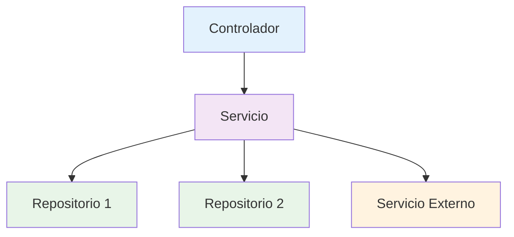

# Semana 9 - Servicios en Spring Boot para API REST

!!! abstract "Resumen ejecutivo"
    Los **servicios** en Spring Boot son componentes que contienen la **lógica de negocio** de la aplicación. Actúan como una capa intermedia entre los controladores (que manejan las peticiones HTTP) y los repositorios (que acceden a los datos), implementando las reglas de negocio, validaciones y orquestación de operaciones complejas.

---

## 1. ¿Qué es un servicio en Spring Boot?

!!! info "Definición"
    Un **servicio** es una clase anotada con `@Service` que encapsula la lógica de negocio de la aplicación. Es responsable de procesar datos, aplicar reglas de negocio, coordinar operaciones entre múltiples repositorios y preparar la información para ser consumida por los controladores.

### 1.1 Responsabilidades de un servicio

| Responsabilidad | Descripción | Ejemplo |
|----------------|-------------|----------|
| **Lógica de negocio** | Implementa las reglas específicas del dominio | Calcular descuentos, validar stock |
| **Orquestación** | Coordina operaciones entre múltiples repositorios | Crear pedido + actualizar inventario |
| **Transformación** | Convierte entre DTOs y entidades | Entity ↔ DTO mapping |
| **Validación** | Aplica validaciones complejas de negocio | Verificar límites de crédito |
| **Transacciones** | Maneja la consistencia de datos | Operaciones atómicas |

### 1.2 Ventajas de usar servicios



- **Separación de responsabilidades**: Controladores se enfocan en HTTP, servicios en lógica
- **Reutilización**: Un servicio puede ser usado por múltiples controladores
- **Testabilidad**: Fácil de probar unitariamente con mocks
- **Mantenibilidad**: Cambios en lógica de negocio centralizados
- **Escalabilidad**: Permite distribución de servicios en microservicios

---

## 2. Anatomía de un servicio

### 2.1 Estructura básica

```java
package com.ejemplo.demo.service;

import org.springframework.stereotype.Service;
import org.springframework.beans.factory.annotation.Autowired;
import org.springframework.transaction.annotation.Transactional;

@Service                    // 1. Anotación que marca la clase como servicio
@Transactional             // 2. Manejo automático de transacciones
public class ProductoService {
    
    @Autowired             // 3. Inyección de dependencias
    private ProductoRepository productoRepository;
    
    // 4. Métodos que implementan lógica de negocio
    public ProductoDTO crearProducto(ProductoDTO productoDTO) {
        // Lógica de negocio aquí
    }
}
```

### 2.2 Anotaciones importantes

#### `@Service`
- **Propósito**: Marca la clase como un componente de servicio
- **Funcionalidad**: Spring la detecta automáticamente para inyección de dependencias
- **Equivalente**: `@Component` especializado para servicios

#### `@Transactional`
- **Propósito**: Manejo automático de transacciones de base de datos
- **Comportamiento**: Si hay error, hace rollback automático
- **Niveles**: Clase (todas las operaciones) o método (operaciones específicas)

#### `@Autowired`
- **Propósito**: Inyección automática de dependencias
- **Alternativas**: Constructor injection (recomendado) o `@RequiredArgsConstructor` con Lombok

---

## 3. Implementación práctica paso a paso

### 3.1 Entidad y DTO

Primero, definamos nuestras clases base:

```java
// Entidad (ya vista en semanas anteriores)
@Entity
@Table(name = "productos")
@Data
@NoArgsConstructor
@AllArgsConstructor
public class Producto {
    @Id
    @GeneratedValue(strategy = GenerationType.IDENTITY)
    private Long id;
    
    @Column(nullable = false)
    private String nombre;
    
    private String descripcion;
    
    @Column(nullable = false)
    private BigDecimal precio;
    
    @Column(nullable = false)
    private Integer stock;
    
    @Column(nullable = false)
    private Boolean activo = true;
    
    @Column(name = "fecha_creacion")
    private LocalDateTime fechaCreacion;
    
    @PrePersist
    protected void onCreate() {
        fechaCreacion = LocalDateTime.now();
    }
}

// DTO para transferencia de datos
@Data
@NoArgsConstructor
@AllArgsConstructor
public class ProductoDTO {
    private Long id;
    private String nombre;
    private String descripcion;
    private BigDecimal precio;
    private Integer stock;
    private Boolean activo;
    private LocalDateTime fechaCreacion;
}

// DTO para creación (sin ID ni fecha)
@Data
@NoArgsConstructor
@AllArgsConstructor
public class CrearProductoDTO {
    @NotBlank(message = "El nombre es obligatorio")
    private String nombre;
    
    private String descripcion;
    
    @NotNull(message = "El precio es obligatorio")
    @DecimalMin(value = "0.01", message = "El precio debe ser mayor a 0")
    private BigDecimal precio;
    
    @NotNull(message = "El stock es obligatorio")
    @Min(value = 0, message = "El stock no puede ser negativo")
    private Integer stock;
}
```

### 3.2 Repositorio (repaso rápido)

```java
@Repository
public interface ProductoRepository extends JpaRepository<Producto, Long> {
    List<Producto> findByActivo(Boolean activo);
    List<Producto> findByNombreContainingIgnoreCase(String nombre);
    List<Producto> findByPrecioBetween(BigDecimal min, BigDecimal max);
    
    @Query("SELECT p FROM Producto p WHERE p.stock < :stockMinimo")
    List<Producto> findProductosBajoStock(@Param("stockMinimo") Integer stockMinimo);
}
```

### 3.3 Servicio completo

```java
package com.ejemplo.demo.service;

import com.ejemplo.demo.entity.Producto;
import com.ejemplo.demo.dto.ProductoDTO;
import com.ejemplo.demo.dto.CrearProductoDTO;
import com.ejemplo.demo.repository.ProductoRepository;
import com.ejemplo.demo.exception.ProductoNotFoundException;
import com.ejemplo.demo.exception.StockInsuficienteException;

import org.springframework.beans.factory.annotation.Autowired;
import org.springframework.data.domain.Page;
import org.springframework.data.domain.Pageable;
import org.springframework.stereotype.Service;
import org.springframework.transaction.annotation.Transactional;

import java.math.BigDecimal;
import java.util.List;
import java.util.Optional;
import java.util.stream.Collectors;

@Service
@Transactional
public class ProductoService {
    
    @Autowired
    private ProductoRepository productoRepository;
    
    // ========== OPERACIONES CRUD ==========
    
    /**
     * Crear un nuevo producto
     */
    public ProductoDTO crearProducto(CrearProductoDTO crearProductoDTO) {
        // 1. Validaciones de negocio
        validarDatosProducto(crearProductoDTO);
        
        // 2. Verificar que no existe producto con el mismo nombre
        if (existeProductoConNombre(crearProductoDTO.getNombre())) {
            throw new IllegalArgumentException("Ya existe un producto con ese nombre");
        }
        
        // 3. Convertir DTO a entidad
        Producto producto = new Producto();
        producto.setNombre(crearProductoDTO.getNombre());
        producto.setDescripcion(crearProductoDTO.getDescripcion());
        producto.setPrecio(crearProductoDTO.getPrecio());
        producto.setStock(crearProductoDTO.getStock());
        producto.setActivo(true);
        
        // 4. Guardar en base de datos
        Producto productoGuardado = productoRepository.save(producto);
        
        // 5. Convertir entidad a DTO y retornar
        return convertirADTO(productoGuardado);
    }
    
    /**
     * Obtener producto por ID
     */
    @Transactional(readOnly = true)
    public ProductoDTO obtenerProductoPorId(Long id) {
        Producto producto = productoRepository.findById(id)
            .orElseThrow(() -> new ProductoNotFoundException("Producto no encontrado con ID: " + id));
        
        return convertirADTO(producto);
    }
    
    /**
     * Obtener todos los productos con paginación
     */
    @Transactional(readOnly = true)
    public Page<ProductoDTO> obtenerTodosLosProductos(Pageable pageable) {
        Page<Producto> productos = productoRepository.findAll(pageable);
        return productos.map(this::convertirADTO);
    }
    
    /**
     * Actualizar producto existente
     */
    public ProductoDTO actualizarProducto(Long id, CrearProductoDTO actualizarDTO) {
        // 1. Verificar que el producto existe
        Producto productoExistente = productoRepository.findById(id)
            .orElseThrow(() -> new ProductoNotFoundException("Producto no encontrado con ID: " + id));
        
        // 2. Validaciones de negocio
        validarDatosProducto(actualizarDTO);
        
        // 3. Verificar nombre único (excluyendo el producto actual)
        if (!productoExistente.getNombre().equals(actualizarDTO.getNombre()) && 
            existeProductoConNombre(actualizarDTO.getNombre())) {
            throw new IllegalArgumentException("Ya existe otro producto con ese nombre");
        }
        
        // 4. Actualizar campos
        productoExistente.setNombre(actualizarDTO.getNombre());
        productoExistente.setDescripcion(actualizarDTO.getDescripcion());
        productoExistente.setPrecio(actualizarDTO.getPrecio());
        productoExistente.setStock(actualizarDTO.getStock());
        
        // 5. Guardar cambios
        Producto productoActualizado = productoRepository.save(productoExistente);
        
        return convertirADTO(productoActualizado);
    }
    
    /**
     * Eliminar producto (eliminación lógica)
     */
    public void eliminarProducto(Long id) {
        Producto producto = productoRepository.findById(id)
            .orElseThrow(() -> new ProductoNotFoundException("Producto no encontrado con ID: " + id));
        
        // Eliminación lógica (marcar como inactivo)
        producto.setActivo(false);
        productoRepository.save(producto);
    }
    
    // ========== OPERACIONES DE NEGOCIO ==========
    
    /**
     * Buscar productos activos
     */
    @Transactional(readOnly = true)
    public List<ProductoDTO> obtenerProductosActivos() {
        List<Producto> productos = productoRepository.findByActivo(true);
        return productos.stream()
                .map(this::convertirADTO)
                .collect(Collectors.toList());
    }
    
    /**
     * Buscar productos por nombre
     */
    @Transactional(readOnly = true)
    public List<ProductoDTO> buscarProductosPorNombre(String nombre) {
        List<Producto> productos = productoRepository.findByNombreContainingIgnoreCase(nombre);
        return productos.stream()
                .map(this::convertirADTO)
                .collect(Collectors.toList());
    }
    
    /**
     * Buscar productos por rango de precios
     */
    @Transactional(readOnly = true)
    public List<ProductoDTO> buscarProductosPorRangoPrecios(BigDecimal precioMin, BigDecimal precioMax) {
        // Validación de parámetros
        if (precioMin.compareTo(precioMax) > 0) {
            throw new IllegalArgumentException("El precio mínimo no puede ser mayor al precio máximo");
        }
        
        List<Producto> productos = productoRepository.findByPrecioBetween(precioMin, precioMax);
        return productos.stream()
                .map(this::convertirADTO)
                .collect(Collectors.toList());
    }
    
    /**
     * Obtener productos con stock bajo
     */
    @Transactional(readOnly = true)
    public List<ProductoDTO> obtenerProductosBajoStock(Integer stockMinimo) {
        List<Producto> productos = productoRepository.findProductosBajoStock(stockMinimo);
        return productos.stream()
                .map(this::convertirADTO)
                .collect(Collectors.toList());
    }
    
    /**
     * Actualizar stock de producto (para ventas)
     */
    public ProductoDTO actualizarStock(Long id, Integer cantidadVendida) {
        Producto producto = productoRepository.findById(id)
            .orElseThrow(() -> new ProductoNotFoundException("Producto no encontrado con ID: " + id));
        
        // Validar que hay suficiente stock
        if (producto.getStock() < cantidadVendida) {
            throw new StockInsuficienteException(
                String.format("Stock insuficiente. Disponible: %d, Solicitado: %d", 
                             producto.getStock(), cantidadVendida));
        }
        
        // Actualizar stock
        producto.setStock(producto.getStock() - cantidadVendida);
        
        // Si el stock llega a 0, marcar como inactivo
        if (producto.getStock() == 0) {
            producto.setActivo(false);
        }
        
        Producto productoActualizado = productoRepository.save(producto);
        return convertirADTO(productoActualizado);
    }
    
    /**
     * Calcular valor total del inventario
     */
    @Transactional(readOnly = true)
    public BigDecimal calcularValorTotalInventario() {
        List<Producto> productosActivos = productoRepository.findByActivo(true);
        
        return productosActivos.stream()
                .map(producto -> producto.getPrecio().multiply(BigDecimal.valueOf(producto.getStock())))
                .reduce(BigDecimal.ZERO, BigDecimal::add);
    }
    
    // ========== MÉTODOS AUXILIARES ==========
    
    /**
     * Convertir entidad a DTO
     */
    private ProductoDTO convertirADTO(Producto producto) {
        ProductoDTO dto = new ProductoDTO();
        dto.setId(producto.getId());
        dto.setNombre(producto.getNombre());
        dto.setDescripcion(producto.getDescripcion());
        dto.setPrecio(producto.getPrecio());
        dto.setStock(producto.getStock());
        dto.setActivo(producto.getActivo());
        dto.setFechaCreacion(producto.getFechaCreacion());
        return dto;
    }
    
    /**
     * Validar datos del producto
     */
    private void validarDatosProducto(CrearProductoDTO dto) {
        if (dto.getNombre() == null || dto.getNombre().trim().isEmpty()) {
            throw new IllegalArgumentException("El nombre del producto es obligatorio");
        }
        
        if (dto.getPrecio() == null || dto.getPrecio().compareTo(BigDecimal.ZERO) <= 0) {
            throw new IllegalArgumentException("El precio debe ser mayor a 0");
        }
        
        if (dto.getStock() == null || dto.getStock() < 0) {
            throw new IllegalArgumentException("El stock no puede ser negativo");
        }
    }
    
    /**
     * Verificar si existe producto con el nombre dado
     */
    private boolean existeProductoConNombre(String nombre) {
        List<Producto> productos = productoRepository.findByNombreContainingIgnoreCase(nombre);
        return productos.stream()
                .anyMatch(p -> p.getNombre().equalsIgnoreCase(nombre) && p.getActivo());
    }
}
```

---

## 4. Manejo de excepciones personalizadas

### 4.1 Excepciones de negocio

```java
// Excepción base para el dominio
public abstract class BusinessException extends RuntimeException {
    public BusinessException(String message) {
        super(message);
    }
    
    public BusinessException(String message, Throwable cause) {
        super(message, cause);
    }
}

// Producto no encontrado
public class ProductoNotFoundException extends BusinessException {
    public ProductoNotFoundException(String message) {
        super(message);
    }
}

// Stock insuficiente
public class StockInsuficienteException extends BusinessException {
    public StockInsuficienteException(String message) {
        super(message);
    }
}

// Datos inválidos
public class DatosInvalidosException extends BusinessException {
    public DatosInvalidosException(String message) {
        super(message);
    }
}
```

### 4.2 Manejador global de excepciones

```java
@RestControllerAdvice
public class GlobalExceptionHandler {
    
    @ExceptionHandler(ProductoNotFoundException.class)
    public ResponseEntity<ErrorResponse> handleProductoNotFound(ProductoNotFoundException ex) {
        ErrorResponse error = new ErrorResponse(
            "PRODUCTO_NO_ENCONTRADO",
            ex.getMessage(),
            LocalDateTime.now()
        );
        return ResponseEntity.status(HttpStatus.NOT_FOUND).body(error);
    }
    
    @ExceptionHandler(StockInsuficienteException.class)
    public ResponseEntity<ErrorResponse> handleStockInsuficiente(StockInsuficienteException ex) {
        ErrorResponse error = new ErrorResponse(
            "STOCK_INSUFICIENTE",
            ex.getMessage(),
            LocalDateTime.now()
        );
        return ResponseEntity.status(HttpStatus.BAD_REQUEST).body(error);
    }
    
    @ExceptionHandler(IllegalArgumentException.class)
    public ResponseEntity<ErrorResponse> handleIllegalArgument(IllegalArgumentException ex) {
        ErrorResponse error = new ErrorResponse(
            "DATOS_INVALIDOS",
            ex.getMessage(),
            LocalDateTime.now()
        );
        return ResponseEntity.status(HttpStatus.BAD_REQUEST).body(error);
    }
}

@Data
@AllArgsConstructor
public class ErrorResponse {
    private String codigo;
    private String mensaje;
    private LocalDateTime timestamp;
}
```

---

## 5. Integración con controladores

### 5.1 Controlador REST completo

```java
@RestController
@RequestMapping("/api/productos")
@Validated
public class ProductoController {
    
    @Autowired
    private ProductoService productoService;
    
    // Crear producto
    @PostMapping
    public ResponseEntity<ProductoDTO> crearProducto(
            @Valid @RequestBody CrearProductoDTO crearProductoDTO) {
        ProductoDTO producto = productoService.crearProducto(crearProductoDTO);
        return ResponseEntity.status(HttpStatus.CREATED).body(producto);
    }
    
    // Obtener producto por ID
    @GetMapping("/{id}")
    public ResponseEntity<ProductoDTO> obtenerProducto(@PathVariable Long id) {
        ProductoDTO producto = productoService.obtenerProductoPorId(id);
        return ResponseEntity.ok(producto);
    }
    
    // Listar productos con paginación
    @GetMapping
    public ResponseEntity<Page<ProductoDTO>> listarProductos(
            @RequestParam(defaultValue = "0") int page,
            @RequestParam(defaultValue = "10") int size,
            @RequestParam(defaultValue = "id") String sortBy,
            @RequestParam(defaultValue = "asc") String sortDir) {
        
        Sort sort = sortDir.equalsIgnoreCase("desc") ? 
                   Sort.by(sortBy).descending() : 
                   Sort.by(sortBy).ascending();
        
        Pageable pageable = PageRequest.of(page, size, sort);
        Page<ProductoDTO> productos = productoService.obtenerTodosLosProductos(pageable);
        
        return ResponseEntity.ok(productos);
    }
    
    // Actualizar producto
    @PutMapping("/{id}")
    public ResponseEntity<ProductoDTO> actualizarProducto(
            @PathVariable Long id,
            @Valid @RequestBody CrearProductoDTO actualizarDTO) {
        ProductoDTO producto = productoService.actualizarProducto(id, actualizarDTO);
        return ResponseEntity.ok(producto);
    }
    
    // Eliminar producto
    @DeleteMapping("/{id}")
    public ResponseEntity<Void> eliminarProducto(@PathVariable Long id) {
        productoService.eliminarProducto(id);
        return ResponseEntity.noContent().build();
    }
    
    // Buscar productos activos
    @GetMapping("/activos")
    public ResponseEntity<List<ProductoDTO>> obtenerProductosActivos() {
        List<ProductoDTO> productos = productoService.obtenerProductosActivos();
        return ResponseEntity.ok(productos);
    }
    
    // Buscar por nombre
    @GetMapping("/buscar")
    public ResponseEntity<List<ProductoDTO>> buscarPorNombre(
            @RequestParam String nombre) {
        List<ProductoDTO> productos = productoService.buscarProductosPorNombre(nombre);
        return ResponseEntity.ok(productos);
    }
    
    // Buscar por rango de precios
    @GetMapping("/precio")
    public ResponseEntity<List<ProductoDTO>> buscarPorPrecio(
            @RequestParam @DecimalMin("0.01") BigDecimal min,
            @RequestParam @DecimalMin("0.01") BigDecimal max) {
        List<ProductoDTO> productos = productoService.buscarProductosPorRangoPrecios(min, max);
        return ResponseEntity.ok(productos);
    }
    
    // Productos con stock bajo
    @GetMapping("/stock-bajo")
    public ResponseEntity<List<ProductoDTO>> obtenerStockBajo(
            @RequestParam(defaultValue = "10") Integer stockMinimo) {
        List<ProductoDTO> productos = productoService.obtenerProductosBajoStock(stockMinimo);
        return ResponseEntity.ok(productos);
    }
    
    // Actualizar stock (para ventas)
    @PatchMapping("/{id}/stock")
    public ResponseEntity<ProductoDTO> actualizarStock(
            @PathVariable Long id,
            @RequestParam @Min(1) Integer cantidad) {
        ProductoDTO producto = productoService.actualizarStock(id, cantidad);
        return ResponseEntity.ok(producto);
    }
    
    // Valor total del inventario
    @GetMapping("/valor-inventario")
    public ResponseEntity<Map<String, BigDecimal>> obtenerValorInventario() {
        BigDecimal valor = productoService.calcularValorTotalInventario();
        Map<String, BigDecimal> response = Map.of("valorTotal", valor);
        return ResponseEntity.ok(response);
    }
}
```

---


