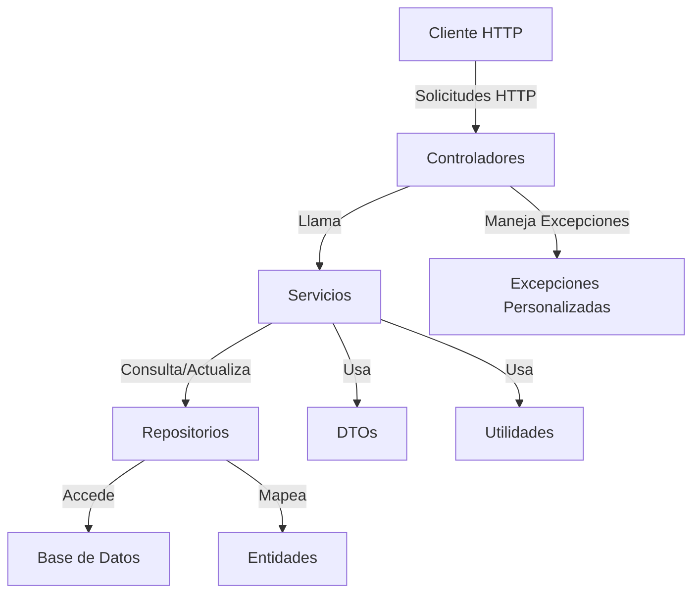
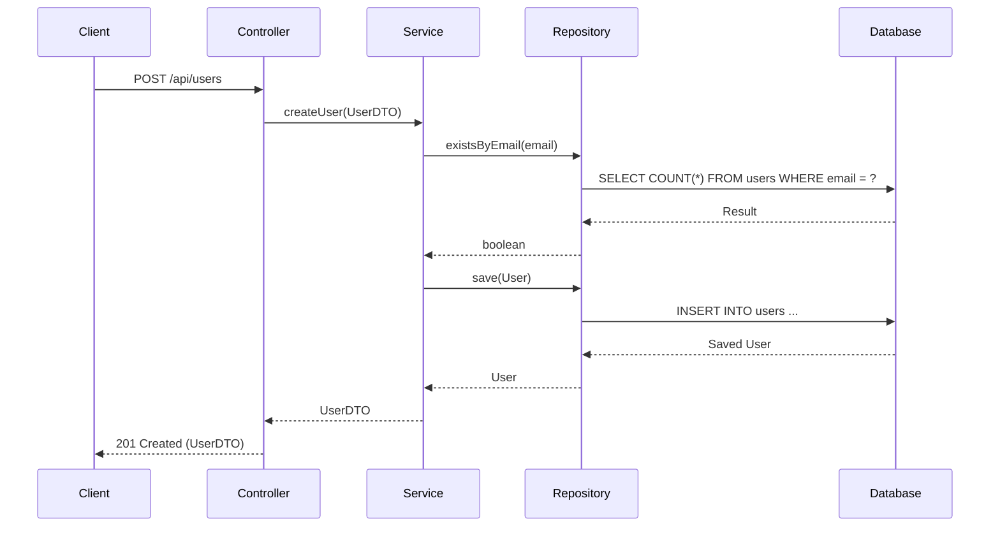

# Estructuración de un Proyecto API REST en Spring Boot

!!! info "Introducción"
    La estructura de un proyecto **API REST** en Spring Boot debe ser clara, modular y seguir principios de diseño como **separación de preocupaciones** (SoC) y **arquitectura limpia**. Esto facilita el mantenimiento, la escalabilidad y las pruebas del código. En esta guía, se detalla una estructura recomendada basada en una arquitectura por capas, explicando el propósito de cada componente, con ejemplos prácticos y diagramas para ilustrar la organización.

## Principios de Diseño

Antes de definir la estructura, es importante basarse en principios clave:

- **Separación de Preocupaciones (SoC):** Divide el proyecto en capas con responsabilidades específicas (presentación, lógica de negocio, acceso a datos).
- **Arquitectura Limpia:** Mantén las reglas de negocio independientes de frameworks y bases de datos.
- **Escalabilidad:** La estructura debe permitir agregar nuevas funcionalidades sin afectar las existentes.
- **Testeabilidad:** Facilita la escritura de pruebas unitarias e integrales.
- **Modularidad:** Organiza el código para que sea fácil de entender y modificar.

## Estructura Recomendada: Arquitectura por Capas

La arquitectura por capas es una de las más utilizadas en proyectos Spring Boot. Divide el proyecto en las siguientes capas:

1. **Capa de Presentación (Controllers):** Maneja las solicitudes HTTP y las respuestas.
2. **Capa de Servicio (Services):** Contiene la lógica de negocio.
3. **Capa de Acceso a Datos (Repositories):** Gestiona la interacción con la base de datos.
4. **Capa de Modelo (Entities/DTOs):** Define las entidades de la base de datos y objetos de transferencia de datos (DTOs).
5. **Capa de Configuración:** Configura beans, seguridad, y otras dependencias.
6. **Capa de Utilidades (Utils):** Contiene clases transversales como manejadores de excepciones, validadores, etc.

### Diagrama de Arquitectura



## Estructura de Carpetas

A continuación, se propone una estructura de directorios para un proyecto Spring Boot API REST:

```
my-api-rest/
├── src/
│   ├── main/
│   │   ├── java/
│   │   │   └── com/
│   │   │       └── example/
│   │   │           └── myapi/
│   │   │               ├── Application.java
│   │   │               ├── config/
│   │   │               │   ├── SwaggerConfig.java
│   │   │               │   ├── SecurityConfig.java
│   │   │               ├── controller/
│   │   │               │   ├── UserController.java
│   │   │               ├── service/
│   │   │               │   ├── UserService.java
│   │   │               │   ├── impl/
│   │   │               │   │   ├── UserServiceImpl.java
│   │   │               ├── repository/
│   │   │               │   ├── UserRepository.java
│   │   │               ├── model/
│   │   │               │   ├── entity/
│   │   │               │   │   ├── User.java
│   │   │               │   ├── dto/
│   │   │               │   │   ├── UserDTO.java
│   │   │               │   │   ├── UserCreateDTO.java
│   │   │               ├── exception/
│   │   │               │   ├── ResourceNotFoundException.java
│   │   │               ├── util/
│   │   │               │   ├── MapperUtil.java
│   │   │               │   ├── Constants.java
│   │   └── resources/
│   │       ├── application.properties
│   │       ├── application-dev.properties
│   │       ├── application-prod.properties
│   └── test/
│       ├── java/
│       │   └── com/
│       │       └── example/
│       │           └── myapi/
│       │               ├── controller/
│       │               │   ├── UserControllerTest.java
│       │               ├── service/
│       │               │   ├── UserServiceTest.java
│       └── resources/
│           ├── application-test.properties
├── pom.xml
└── README.md
```

### Explicación de Cada Carpeta/Paquete

1. **config/**: Contiene configuraciones de la aplicación, como:
   - Configuración de **Swagger/OpenAPI** para documentar la API.
   - Configuración de **seguridad** (Spring Security, JWT, etc.).
   - Configuración de beans personalizados.

2. **controller/**: Contiene los controladores REST que manejan las solicitudes HTTP. Usan anotaciones como `@RestController`, `@GetMapping`, `@PostMapping`, etc.

3. **service/**: Contiene interfaces y clases que implementan la lógica de negocio. La subcarpeta `impl/` almacena las implementaciones de las interfaces.

4. **repository/**: Contiene interfaces que extienden `JpaRepository` o `CrudRepository` para interactuar con la base de datos.

5. **model/**:
   - `entity/`: Almacena las entidades JPA (mapeadas a tablas de la base de datos).
   - `dto/`: Contiene objetos de transferencia de datos (DTOs) para aislar la lógica de negocio de la capa de presentación.

6. **exception/**: Define excepciones personalizadas, como `ResourceNotFoundException`, y manejadores globales de excepciones (`@ControllerAdvice`).

7. **util/**: Incluye clases utilitarias, como mapeadores (ej. MapStruct), constantes, o validadores.

8. **resources/**: Contiene archivos de configuración:
   - `application.properties`: Configuración general.
   - Perfiles específicos (`application-dev.properties`, `application-prod.properties`) para entornos.

9. **test/**: Contiene pruebas unitarias e integrales para controladores, servicios y repositorios.

## Ejemplo Completo

A continuación, se presenta un ejemplo práctico de una API REST para gestionar usuarios, con todas las capas implementadas.

### 1. Entidad (`User.java`)

```java
package com.example.myapi.model.entity;

import jakarta.persistence.*;
import java.time.LocalDateTime;

@Entity
@Table(name = "users")
public class User {

    @Id
    @GeneratedValue(strategy = GenerationType.IDENTITY)
    private Long id;

    @Column(nullable = false, unique = true)
    private String email;

    @Column(nullable = false)
    private String name;

    @Column(name = "created_at", nullable = false)
    private LocalDateTime createdAt;

    // Constructores, getters y setters
    public User() {
        this.createdAt = LocalDateTime.now();
    }

    public User(String email, String name) {
        this.email = email;
        this.name = name;
        this.createdAt = LocalDateTime.now();
    }

    // Getters y setters omitidos por brevedad
}
```

### 2. DTO (`UserDTO.java`)

```java
package com.example.myapi.model.dto;

public class UserDTO {
    private Long id;
    private String email;
    private String name;

    // Constructores, getters y setters
    public UserDTO() {}

    public UserDTO(Long id, String email, String name) {
        this.id = id;
        this.email = email;
        this.name = name;
    }

    // Getters y setters omitidos por brevedad
}
```

### 3. Repositorio (`UserRepository.java`)

```java
package com.example.myapi.repository;

import com.example.myapi.model.entity.User;
import org.springframework.data.jpa.repository.JpaRepository;

public interface UserRepository extends JpaRepository<User, Long> {
    boolean existsByEmail(String email);
}
```

### 4. Servicio (`UserService.java` y `UserServiceImpl.java`)

```java
package com.example.myapi.service;

import com.example.myapi.model.dto.UserDTO;

public interface UserService {
    UserDTO createUser(UserDTO userDTO);
    UserDTO getUserById(Long id);
}
```

```java
package com.example.myapi.service.impl;

import com.example.myapi.exception.ResourceNotFoundException;
import com.example.myapi.model.dto.UserDTO;
import com.example.myapi.model.entity.User;
import com.example.myapi.repository.UserRepository;
import com.example.myapi.service.UserService;
import org.springframework.beans.factory.annotation.Autowired;
import org.springframework.stereotype.Service;

@Service
public class UserServiceImpl implements UserService {

    @Autowired
    private UserRepository userRepository;

    @Override
    public UserDTO createUser(UserDTO userDTO) {
        if (userRepository.existsByEmail(userDTO.getEmail())) {
            throw new IllegalArgumentException("Email already exists");
        }
        User user = new User(userDTO.getEmail(), userDTO.getName());
        user = userRepository.save(user);
        return new UserDTO(user.getId(), user.getEmail(), user.getName());
    }

    @Override
    public UserDTO getUserById(Long id) {
        User user = userRepository.findById(id)
                .orElseThrow(() -> new ResourceNotFoundException("User not found with id: " + id));
        return new UserDTO(user.getId(), user.getEmail(), user.getName());
    }
}
```

### 5. Controlador (`UserController.java`)

```java
package com.example.myapi.controller;

import com.example.myapi.model.dto.UserDTO;
import com.example.myapi.service.UserService;
import org.springframework.beans.factory.annotation.Autowired;
import org.springframework.http.ResponseEntity;
import org.springframework.web.bind.annotation.*;

@RestController
@RequestMapping("/api/users")
public class UserController {

    @Autowired
    private UserService userService;

    @PostMapping
    public ResponseEntity<UserDTO> createUser(@RequestBody UserDTO userDTO) {
        UserDTO createdUser = userService.createUser(userDTO);
        return ResponseEntity.status(201).body(createdUser);
    }

    @GetMapping("/{id}")
    public ResponseEntity<UserDTO> getUserById(@PathVariable Long id) {
        UserDTO user = userService.getUserById(id);
        return ResponseEntity.ok(user);
    }
}
```

### 6. Excepción Personalizada (`ResourceNotFoundException.java`)

```java
package com.example.myapi.exception;

public class ResourceNotFoundException extends RuntimeException {
    public ResourceNotFoundException(String message) {
        super(message);
    }
}
```

### 7. Manejador de Excepciones (`GlobalExceptionHandler.java`)

```java
package com.example.myapi.exception;

import org.springframework.http.HttpStatus;
import org.springframework.http.ResponseEntity;
import org.springframework.web.bind.annotation.ControllerAdvice;
import org.springframework.web.bind.annotation.ExceptionHandler;

@ControllerAdvice
public class GlobalExceptionHandler {

    @ExceptionHandler(ResourceNotFoundException.class)
    public ResponseEntity<String> handleResourceNotFoundException(ResourceNotFoundException ex) {
        return ResponseEntity.status(HttpStatus.NOT_FOUND).body(ex.getMessage());
    }

    @ExceptionHandler(IllegalArgumentException.class)
    public ResponseEntity<String> handleIllegalArgumentException(IllegalArgumentException ex) {
        return ResponseEntity.status(HttpStatus.BAD_REQUEST).body(ex.getMessage());
    }
}
```

### 8. Configuración (`application.properties`)

```properties
spring.datasource.url=jdbc:postgresql://localhost:5432/myapi
spring.datasource.username=postgres
spring.datasource.password=secret
spring.jpa.hibernate.ddl-auto=update
spring.jpa.show-sql=true
spring.jpa.properties.hibernate.dialect=org.hibernate.dialect.PostgreSQLDialect
```

## Buenas Prácticas

1. **Usa DTOs:** Separa las entidades de la API pública para evitar exponer detalles de la base de datos.
2. **Inyección de Dependencias:** Usa `@Autowired` o inyección por constructor para servicios y repositorios.
3. **Manejo de Excepciones:** Implementa un manejador global de excepciones con `@ControllerAdvice`.
4. **Documentación:** Usa **Swagger/OpenAPI** para documentar los endpoints.
5. **Pruebas:** Escribe pruebas unitarias para servicios (`@Mockito`) y pruebas integrales para controladores (`@SpringBootTest`).
6. **Perfiles:** Usa perfiles de Spring (`dev`, `prod`) para configuraciones específicas por entorno.
7. **Seguridad:** Implementa Spring Security para proteger los endpoints.

## Diagrama de Flujo de una Solicitud


