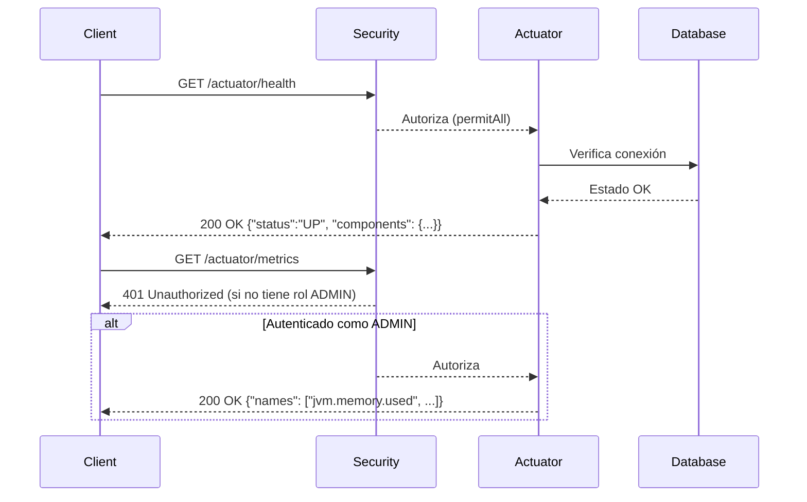

# Spring Boot Actuator: Monitoreo y Gestión de Aplicaciones

!!! info "Introducción"
    **Spring Boot Actuator** es un módulo esencial de Spring Boot que proporciona herramientas para monitorear y gestionar aplicaciones en tiempo real. Ofrece endpoints HTTP y JMX que exponen información sobre la salud, métricas, configuración, entorno y otros aspectos de la aplicación. Es especialmente útil para aplicaciones en producción, ya que permite a los desarrolladores y equipos de operaciones supervisar el rendimiento, diagnosticar problemas y gestionar la aplicación sin necesidad de herramientas externas. Esta guía detalla su propósito, funcionalidades, configuración, ejemplos prácticos y un diagrama para ilustrar su uso.

## ¿Para Qué Sirve Spring Boot Actuator?

Spring Boot Actuator sirve para proporcionar **visibilidad y control** sobre una aplicación Spring Boot en ejecución. Sus principales propósitos son:

**Monitoreo de Salud**:
   
   - Verifica si la aplicación está funcionando correctamente (ej. conexión a base de datos, servicios externos, etc.).
   - Ejemplo: El endpoint `/actuator/health` indica si la aplicación está "UP" o "DOWN".

**Métricas de Rendimiento**:
   
   - Expone métricas como uso de memoria, CPU, solicitudes HTTP, tiempo de respuesta, etc.
   - Ejemplo: El endpoint `/actuator/metrics` proporciona estadísticas detalladas.

**Información de Configuración**:
   
   - Permite inspeccionar propiedades de configuración, variables de entorno y beans gestionados por Spring.
   - Ejemplo: `/actuator/env` muestra las propiedades del entorno.

**Gestión Operativa**:
   
   - Ofrece herramientas para realizar tareas administrativas, como reiniciar la aplicación o cambiar propiedades en tiempo real.
   - Ejemplo: `/actuator/restart` (en configuraciones avanzadas) permite reiniciar la aplicación.

**Depuración y Diagnóstico**:
   
   - Proporciona información detallada para diagnosticar problemas, como trazas de solicitudes HTTP o estado de los hilos.
   - Ejemplo: `/actuator/httptrace` muestra las últimas solicitudes HTTP.

**Integración con Herramientas Externas**:
   
   - Actuator es compatible con herramientas de monitoreo como **Prometheus**, **Grafana**, **New Relic** o **Datadog**, permitiendo exportar métricas para análisis avanzados.

## Características Principales

- **Endpoints Predefinidos**: Actuator proporciona una serie de endpoints HTTP y JMX para acceder a información y realizar acciones.
- **Personalización**: Puedes habilitar/deshabilitar endpoints, configurar seguridad y personalizar la información expuesta.
- **Extensibilidad**: Permite crear endpoints personalizados para necesidades específicas.
- **Seguridad Integrada**: Se integra con Spring Security para restringir el acceso a endpoints sensibles.
- **Soporte para Microservicios**: Es ideal para arquitecturas de microservicios, donde el monitoreo distribuido es crítico.

## Endpoints Comunes de Spring Boot Actuator

Actuator ofrece una variedad de endpoints predefinidos. Los más utilizados son:

| Endpoint                | Propósito                                                                 | Ejemplo de Respuesta (JSON)                              |
|-------------------------|---------------------------------------------------------------------------|----------------------------------------------------------|
| `/actuator/health`      | Muestra el estado de salud de la aplicación (UP/DOWN) y componentes.       | `{"status":"UP"}`                                       |
| `/actuator/info`        | Expone información personalizada sobre la aplicación (ej. nombre, versión).| `{"app":{"name":"My API","version":"1.0.0"}}`           |
| `/actuator/metrics`     | Proporciona métricas de rendimiento (CPU, memoria, solicitudes, etc.).     | `{"names":["jvm.memory.used","http.server.requests"]}` |
| `/actuator/env`         | Muestra propiedades de configuración y variables de entorno.               | `{"activeProfiles":["dev"],"propertySources":[...]}`    |
| `/actuator/beans`       | Lista todos los beans gestionados por Spring.                              | `[{"bean":"myBean","scope":"singleton"}]`              |
| `/actuator/httptrace`   | Registra las últimas solicitudes HTTP (útil para depuración).              | `[{"timestamp":"2025-08-01T23:25:00Z","method":"GET"}]`|
| `/actuator/loggers`     | Muestra y permite modificar niveles de logging en tiempo real.             | `{"levels":{"com.example":"INFO"}}`                    |
| `/actuator/threaddump`  | Proporciona un volcado de hilos para analizar el estado de la aplicación.  | `[{"threadName":"main","threadId":1}]`                 |

!!! note
    Los endpoints están deshabilitados por defecto, excepto `/actuator/health` e `/actuator/info`. Debes habilitarlos explícitamente en la configuración.

## Configuración de Spring Boot Actuator

Para usar Actuator, debes incluir la dependencia en tu proyecto Spring Boot y configurar los endpoints que deseas exponer.

### Dependencia en `pom.xml`

```xml
<dependency>
    <groupId>org.springframework.boot</groupId>
    <artifactId>spring-boot-starter-actuator</artifactId>
</dependency>
```

Esta dependencia ya está incluida si usaste **Spring Initializr** y seleccionaste "Spring Boot Actuator" en el asistente.

### Configuración Básica (`application.properties`)

Habilita los endpoints necesarios y configura la información personalizada:

```properties
# Habilitar endpoints específicos
management.endpoints.web.exposure.include=health,info,metrics,env,beans,httptrace,loggers,threaddump
management.endpoint.health.show-details=always
management.endpoint.info.show-details=always

# Información personalizada para /actuator/info
info.app.name=My REST API
info.app.version=1.0.0
info.app.description=A sample REST API built with Spring Boot
info.author.name=John Doe
info.author.email=john.doe@example.com
info.author.organization=Example Corp
```

- `management.endpoints.web.exposure.include`: Lista los endpoints a exponer (usa `*` para exponer todos).
- `management.endpoint.health.show-details=always`: Muestra detalles de los componentes de salud (ej. base de datos, disco).
- `info.*`: Define propiedades personalizadas para el endpoint `/actuator/info`.

### Ejemplo de Respuesta de `/actuator/health`

Si tienes configurada una base de datos (ej. PostgreSQL), una solicitud a `http://localhost:8080/actuator/health` podría devolver:

```json
{
    "status": "UP",
    "components": {
        "db": {
            "status": "UP",
            "details": {
                "database": "PostgreSQL",
                "validationQuery": "isValid()"
            }
        },
        "diskSpace": {
            "status": "UP",
            "details": {
                "total": 500000000,
                "free": 300000000,
                "threshold": 10000000
            }
        },
        "ping": {
            "status": "UP"
        }
    }
}
```

### Ejemplo de Respuesta de `/actuator/info`

Con la configuración anterior, una solicitud a `http://localhost:8080/actuator/info` devolverá:

```json
{
    "app": {
        "name": "My REST API",
        "version": "1.0.0",
        "description": "A sample REST API built with Spring Boot",
        "author": {
            "name": "John Doe",
            "email": "john.doe@example.com",
            "organization": "Example Corp"
        }
    }
}
```

## Seguridad con Spring Boot Actuator

Dado que los endpoints de Actuator pueden exponer información sensible (como propiedades de entorno o métricas detalladas), es crucial protegerlos con **Spring Security**.

### Configuración de Seguridad (`SecurityConfig.java`)

```java
package com.example.myapi.config;

import org.springframework.context.annotation.Bean;
import org.springframework.context.annotation.Configuration;
import org.springframework.security.config.annotation.web.builders.HttpSecurity;
import org.springframework.security.config.annotation.web.configuration.EnableWebSecurity;
import org.springframework.security.web.SecurityFilterChain;

@Configuration
@EnableWebSecurity
public class SecurityConfig {

    @Bean
    public SecurityFilterChain securityFilterChain(HttpSecurity http) throws Exception {
        http
            .authorizeHttpRequests(auth -> auth
                .requestMatchers("/actuator/health", "/actuator/info").permitAll() // Acceso público
                .requestMatchers("/actuator/**").hasRole("ADMIN") // Solo para admin
                .anyRequest().authenticated()
            )
            .csrf(csrf -> csrf.disable())
            .httpBasic();
        return http.build();
    }
}
```

### Explicación
- `/actuator/health` e `/actuator/info` son accesibles públicamente para monitoreo básico.
- Otros endpoints (como `/actuator/metrics`, `/actuator/env`) están restringidos a usuarios con el rol `ADMIN`.
- Deshabilitar CSRF es común para APIs REST, pero evalúa si es necesario según tu caso.

## Ejemplo Práctico: Monitoreo de una API REST

Supongamos que tienes una API REST para gestionar usuarios. Puedes usar Actuator para monitorear su estado.

### Configuración (`application.properties`)

```properties
spring.datasource.url=jdbc:postgresql://localhost:5432/myapi
spring.datasource.username=postgres
spring.datasource.password=secret
spring.jpa.hibernate.ddl-auto=update
spring.jpa.show-sql=true
spring.jpa.properties.hibernate.dialect=org.hibernate.dialect.PostgreSQLDialect

# Actuator configuration
management.endpoints.web.exposure.include=health,info,metrics,httptrace
management.endpoint.health.show-details=always
info.app.name=My REST API
info.app.version=1.0.0
info.app.description=A sample REST API for user management
info.author.name=John Doe
```

### Probando los Endpoints

**Verificar Salud**:
   
   - Solicitud: `GET http://localhost:8080/actuator/health`
   - Respuesta: Confirma que la base de datos y otros componentes están funcionando.

**Obtener Información**:
   
   - Solicitud: `GET http://localhost:8080/actuator/info`
   - Respuesta: Muestra los metadatos de la API (nombre, versión, autor).

**Consultar Métricas**:
   
   - Solicitud: `GET http://localhost:8080/actuator/metrics`
   - Respuesta: Lista métricas disponibles (ej. `http.server.requests`).
   - Detalle: `GET http://localhost:8080/actuator/metrics/http.server.requests` para métricas específicas.

## Diagrama de Flujo de una Solicitud a Actuator



## Integración con Herramientas Externas

Actuator se integra fácilmente con herramientas de monitoreo:

**Prometheus**:
   
   - Agrega la dependencia `micrometer-registry-prometheus`:
     ```xml
     <dependency>
         <groupId>io.micrometer</groupId>
         <artifactId>micrometer-registry-prometheus</artifactId>
     </dependency>
     ```
   - Habilita el endpoint `/actuator/prometheus`:
     ```properties
     management.endpoints.web.exposure.include=prometheus
     ```
   - Configura Prometheus para scrapear métricas desde `/actuator/prometheus`.

**Grafana**:
   
   - Usa las métricas de Prometheus para visualizarlas en dashboards de Grafana.

**Spring Boot Admin**:
   
   - Implementa un servidor de Spring Boot Admin para monitorear múltiples aplicaciones con Actuator.

## Mejores Prácticas

**Restringe Endpoints Sensibles**:
   
   - Usa Spring Security para limitar el acceso a endpoints como `/actuator/env` o `/actuator/beans`.

**Habilita Solo lo Necesario**:
   
   - Evita exponer todos los endpoints con `management.endpoints.web.exposure.include=*` a menos que sea estrictamente necesario.

**Personaliza `/actuator/info`**:
   
   - Incluye metadatos útiles como el nombre, versión y autor de la API.

**Usa Perfiles**:
   
   - Configura Actuator de manera diferente en entornos de desarrollo (`application-dev.properties`) y producción (`application-prod.properties`).

**Monitoreo Proactivo**:
   
   - Configura alertas basadas en `/actuator/health` para detectar fallos rápidamente.

**Integración con Documentación**:
   
   - Si usas Swagger, documenta que `/actuator/info` es el punto de entrada para información general de la API.

