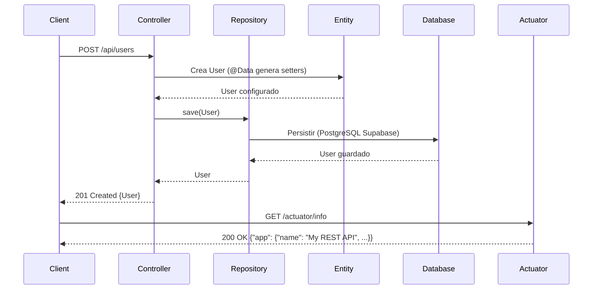

# Tutorial Completo de Lombok en Spring Boot

!!! info "Introducción"
    **Lombok** es una biblioteca de Java que simplifica el desarrollo al eliminar código repetitivo mediante anotaciones que generan automáticamente métodos como getters, setters, constructores, `toString`, `equals`, y `hashCode`. En proyectos Spring Boot, Lombok es ampliamente utilizado para reducir el *boilerplate* en entidades JPA, DTOs, y otras clases, mejorando la legibilidad y mantenibilidad. Este tutorial cubre cómo integrar Lombok en un proyecto Spring Boot, incluyendo la configuración, ejemplos prácticos, integración con tu setup existente (PostgreSQL, Spring Security, Actuator), y mejores prácticas. Incluye un diagrama  para ilustrar el flujo.

## ¿Qué es Lombok?

Lombok (Project Lombok) es una biblioteca que utiliza el procesamiento de anotaciones (*annotation processing*) para generar código en tiempo de compilación. En lugar de escribir manualmente métodos repetitivos, puedes usar anotaciones como `@Getter`, `@Setter`, `@Data`, o `@Builder` para que Lombok los genere automáticamente.

### Beneficios
- **Reducción de Código**: Elimina la necesidad de escribir getters, setters, y otros métodos estándar.
- **Legibilidad**: Hace que las clases sean más limpias y fáciles de mantener.
- **Productividad**: Acelera el desarrollo al evitar tareas repetitivas.
- **Integración con Spring**: Funciona perfectamente con Spring Boot, especialmente en entidades JPA y DTOs.

### Limitaciones
- **Dependencia en IDE**: Requiere configuración en IDEs como IntelliJ o Eclipse para soportar las anotaciones.
- **Debugging**: El código generado no es visible en el archivo fuente, lo que puede complicar la depuración.
- **Uso Prudente**: Anotaciones como `@Data` pueden generar métodos innecesarios si no se usan con cuidado.

## Configuración de Lombok en Spring Boot

### Paso 1: Agrega la Dependencia de Lombok

Incluye la dependencia de Lombok en tu `pom.xml`. Si usaste **Spring Initializr** (como en tu contexto previo), puedes seleccionarla directamente.

#### `pom.xml`

```xml
<?xml version="1.0" encoding="UTF-8"?>
<project xmlns="http://maven.apache.org/POM/4.0.0"
         xmlns:xsi="http://www.w3.org/2001/XMLSchema-instance"
         xsi:schemaLocation="http://maven.apache.org/POM/4.0.0 http://maven.apache.org/xsd/maven-4.0.0.xsd">
    <modelVersion>4.0.0</modelVersion>

    <groupId>com.example</groupId>
    <artifactId>my-api-rest</artifactId>
    <version>0.0.1-SNAPSHOT</version>
    <name>my-api-rest</name>
    <description>Demo project for Spring Boot API REST</description>

    <parent>
        <groupId>org.springframework.boot</groupId>
        <artifactId>spring-boot-starter-parent</artifactId>
        <version>3.3.2</version>
        <relativePath/>
    </parent>

    <properties>
        <java.version>21</java.version>
        <lombok.version>1.18.34</lombok.version>
    </properties>

    <dependencies>
        <!-- Spring Web -->
        <dependency>
            <groupId>org.springframework.boot</groupId>
            <artifactId>spring-boot-starter-web</artifactId>
        </dependency>
        <!-- Spring Data JPA -->
        <dependency>
            <groupId>org.springframework.boot</groupId>
            <artifactId>spring-boot-starter-data-jpa</artifactId>
        </dependency>
        <!-- PostgreSQL Driver -->
        <dependency>
            <groupId>org.postgresql</groupId>
            <artifactId>postgresql</artifactId>
            <scope>runtime</scope>
        </dependency>
        <!-- Spring Security -->
        <dependency>
            <groupId>org.springframework.boot</groupId>
            <artifactId>spring-boot-starter-security</artifactId>
        </dependency>
        <!-- Spring Boot Actuator -->
        <dependency>
            <groupId>org.springframework.boot</groupId>
            <artifactId>spring-boot-starter-actuator</artifactId>
        </dependency>
        <!-- Lombok -->
        <dependency>
            <groupId>org.projectlombok</groupId>
            <artifactId>lombok</artifactId>
            <version>${lombok.version}</version>
            <scope>provided</scope>
        </dependency>
        <!-- Spring Boot Test -->
        <dependency>
            <groupId>org.springframework.boot</groupId>
            <artifactId>spring-boot-starter-test</artifactId>
            <scope>test</scope>
        </dependency>
    </dependencies>

    <build>
        <plugins>
            <plugin>
                <groupId>org.springframework.boot</groupId>
                <artifactId>spring-boot-maven-plugin</artifactId>
            </plugin>
            <plugin>
                <groupId>org.apache.maven.plugins</groupId>
                <artifactId>maven-compiler-plugin</artifactId>
                <version>3.13.0</version>
                <configuration>
                    <source>${java.version}</source>
                    <target>${java.version}</target>
                    <annotationProcessorPaths>
                        <path>
                            <groupId>org.projectlombok</groupId>
                            <artifactId>lombok</artifactId>
                            <version>${lombok.version}</version>
                        </path>
                    </annotationProcessorPaths>
                </configuration>
            </plugin>
        </plugins>
    </build>
</project>
```

- **Notas**:
  - `<scope>provided</scope>`: Indica que Lombok solo se usa en compilación, no en runtime.
  - `maven-compiler-plugin`: Configura el procesador de anotaciones de Lombok.

### Paso 2: Configura tu IDE

Lombok requiere soporte en el IDE para reconocer las anotaciones y evitar errores falsos en el código.

#### IntelliJ IDEA
1. Ve a **File > Settings > Plugins**.
2. Busca e instala el plugin **Lombok**.
3. Habilita el procesamiento de anotaciones:
   - **File > Settings > Build, Execution, Deployment > Compiler > Annotation Processors**.
   - Marca **Enable annotation processing**.
4. Reinicia IntelliJ.

#### Eclipse
1. Descarga el JAR de Lombok desde [projectlombok.org](https://projectlombok.org).
2. Ejecuta `java -jar lombok.jar` y sigue el instalador para agregar Lombok al IDE.
3. Asegúrate de que el proyecto tenga habilitado el procesamiento de anotaciones:
   - Haz clic derecho en el proyecto > **Properties > Java Compiler > Annotation Processing > Enable annotation processing**.

### Paso 3: Configura `application.properties`

Integra Lombok con tu configuración existente de PostgreSQL, Actuator, y Spring Security.

#### `application.properties`

```properties
# Configuración de PostgreSQL (Supabase)
spring.datasource.url=jdbc:postgresql://aws-0-us-east-1.pooler.supabase.com:5432/postgres
spring.datasource.username=postgres.atnasvyigqgxxpavyvvw
spring.datasource.password=[YOUR-PASSWORD]
spring.datasource.driver-class-name=org.postgresql.Driver
spring.jpa.hibernate.ddl-auto=update
spring.jpa.show-sql=true
spring.jpa.properties.hibernate.dialect=org.hibernate.dialect.PostgreSQLDialect

# Configuración de Actuator
management.endpoints.web.exposure.include=health,info
management.endpoint.info.enabled=true
management.endpoint.health.show-details=always
info.app.name=My REST API
info.app.version=1.0.0
info.app.description=A sample REST API built with Spring Boot
info.app.author.name=John Doe
info.app.author.email=john.doe@example.com
info.app.author.organization=Example Corp

# Configuración de usuario para Spring Security
spring.security.user.name=admin
spring.security.user.password=secret
spring.security.user.roles=ADMIN
```

- **Notas**:
  - Reemplaza `[YOUR-PASSWORD]` con la contraseña de Supabase.
  - La configuración de Actuator asegura que `/actuator/info` funcione correctamente (solucionando tu problema previo de respuesta vacía).

### Paso 4: Configura Spring Security

Asegúrate de que los endpoints de Actuator sean accesibles y que tu API sea segura.

#### `SecurityConfig.java`

```java
package com.example.myapi.config;

import org.springframework.context.annotation.Bean;
import org.springframework.context.annotation.Configuration;
import org.springframework.security.config.annotation.web.builders.HttpSecurity;
import org.springframework.security.config.annotation.web.configuration.EnableWebSecurity;
import org.springframework.security.web.SecurityFilterChain;

@Configuration
@EnableWebSecurity
public class SecurityConfig {

    @Bean
    public SecurityFilterChain securityFilterChain(HttpSecurity http) throws Exception {
        http
            .authorizeHttpRequests(auth -> auth
                .requestMatchers("/actuator/info", "/actuator/health", "/api/users").permitAll()
                .requestMatchers("/actuator/**").hasRole("ADMIN")
                .anyRequest().authenticated()
            )
            .csrf(csrf -> csrf.disable())
            .httpBasic(httpBasic -> httpBasic.realmName("My API"));
        return http.build();
    }
}
```

- **Notas**:
  - `/api/users` se agregó como accesible públicamente para facilitar las pruebas.

## Uso de Anotaciones de Lombok

Lombok ofrece varias anotaciones para simplificar el código. A continuación, se presentan las más comunes con ejemplos en el contexto de una API REST.

### 1. `@Data`
Genera getters, setters, `toString`, `equals`, `hashCode`, y un constructor requerido.

#### Ejemplo: Entidad JPA (`User.java`)

```java
package com.example.myapi.model.entity;

import jakarta.persistence.*;
import lombok.Data;

@Entity
@Table(name = "users")
@Data
public class User {

    @Id
    @GeneratedValue(strategy = GenerationType.IDENTITY)
    private Long id;

    @Column(nullable = false, unique = true)
    private String email;

    @Column(nullable = false)
    private String name;
}
```

- **Equivalente sin Lombok**:
  ```java
  public class User {
      private Long id;
      private String email;
      private String name;

      public User() {}
      public User(Long id, String email, String name) {
          this.id = id;
          this.email = email;
          this.name = name;
      }
      public Long getId() { return id; }
      public void setId(Long id) { this.id = id; }
      public String getEmail() { return email; }
      public void setEmail(String email) { this.email = email; }
      public String getName() { return name; }
      public void setName(String name) { this.name = name; }
      @Override
      public String toString() { return "User{id=" + id + ", email='" + email + "', name='" + name + "'}"; }
      @Override
      public boolean equals(Object o) { /* Implementación */ }
      @Override
      public int hashCode() { /* Implementación */ }
  }
  ```

### 2. `@Getter` y `@Setter`
Genera solo getters y/o setters para los campos especificados.

#### Ejemplo: DTO (`UserDTO.java`)

```java
package com.example.myapi.model.dto;

import lombok.Getter;
import lombok.Setter;

@Getter
@Setter
public class UserDTO {
    private String email;
    private String name;
}
```

- **Notas**:
  - Usa `@Getter` y `@Setter` individualmente si no necesitas todos los métodos generados por `@Data`.

### 3. `@Builder`
Proporciona un patrón Builder para crear instancias de la clase.

#### Ejemplo: DTO con Builder (`CreateUserDTO.java`)

```java
package com.example.myapi.model.dto;

import lombok.Builder;

@Builder
public class CreateUserDTO {
    private String email;
    private String name;
}
```

- **Uso**:
  ```java
  CreateUserDTO userDTO = CreateUserDTO.builder()
      .email("test@example.com")
      .name("Test User")
      .build();
  ```

### 4. `@AllArgsConstructor` y `@NoArgsConstructor`
Genera constructores con todos los campos o sin argumentos.

#### Ejemplo: Entidad con Constructores (`Product.java`)

```java
package com.example.myapi.model.entity;

import jakarta.persistence.*;
import lombok.AllArgsConstructor;
import lombok.NoArgsConstructor;
import lombok.Getter;
import lombok.Setter;

@Entity
@Table(name = "products")
@Getter
@Setter
@NoArgsConstructor
@AllArgsConstructor
public class Product {
    @Id
    @GeneratedValue(strategy = GenerationType.IDENTITY)
    private Long id;

    @Column(nullable = false)
    private String name;

    private double price;
}
```

### 5. `@ToString` y `@EqualsAndHashCode`
Genera métodos `toString`, `equals`, y `hashCode` personalizados.

#### Ejemplo: Clase con Exclusión (`Order.java`)

```java
package com.example.myapi.model.entity;

import jakarta.persistence.*;
import lombok.ToString;
import lombok.EqualsAndHashCode;

@Entity
@Table(name = "orders")
@ToString(exclude = "sensitiveData")
@EqualsAndHashCode(exclude = "sensitiveData")
public class Order {
    @Id
    @GeneratedValue(strategy = GenerationType.IDENTITY)
    private Long id;

    private String orderNumber;

    @Column(name = "sensitive_data")
    private String sensitiveData;
}
```

- **Notas**:
  - Usa `exclude` para omitir campos sensibles en `toString` o `equals`.

## Ejemplo Práctico: API REST con Lombok

### Repositorio (`UserRepository.java`)

```java
package com.example.myapi.repository;

import com.example.myapi.model.entity.User;
import org.springframework.data.jpa.repository.JpaRepository;

public interface UserRepository extends JpaRepository<User, Long> {
}
```

### Controlador (`UserController.java`)

```java
package com.example.myapi.controller;

import com.example.myapi.model.entity.User;
import com.example.myapi.repository.UserRepository;
import org.springframework.beans.factory.annotation.Autowired;
import org.springframework.http.ResponseEntity;
import org.springframework.web.bind.annotation.*;

@RestController
@RequestMapping("/api/users")
public class UserController {

    @Autowired
    private UserRepository userRepository;

    @PostMapping
    public ResponseEntity<User> createUser(@RequestBody User user) {
        User savedUser = userRepository.save(user);
        return ResponseEntity.status(201).body(savedUser);
    }

    @GetMapping
    public ResponseEntity<Iterable<User>> getAllUsers() {
        return ResponseEntity.ok(userRepository.findAll());
    }
}
```

### Prueba la API

1. Inicia la aplicación:
   ```bash
   mvn spring-boot:run
   ```

2. Crea un usuario:
   ```bash
   curl -X POST http://localhost:8080/api/users \
   -H "Content-Type: application/json" \
   -d '{"email":"test@example.com","name":"Test User"}'
   ```

3. Lista usuarios:
   ```bash
   curl http://localhost:8080/api/users
   ```

4. Verifica Actuator:
   ```bash
   curl http://localhost:8080/actuator/info
   ```
   Respuesta esperada:
   ```json
   {
       "app": {
           "name": "My REST API",
           "version": "1.0.0",
           "description": "A sample REST API built with Spring Boot",
           "author": {
               "name": "John Doe",
               "email": "john.doe@example.com",
               "organization": "Example Corp"
           }
       }
   }
   ```

## Diagrama de Flujo con Lombok



## Mejores Prácticas

**Usa Anotaciones Específicas**:

   - Evita `@Data` si no necesitas todos los métodos. Usa `@Getter`, `@Setter`, o `@Builder` según sea necesario.
   - Ejemplo: Usa `@Getter` y `@Setter` para DTOs, `@Data` para entidades simples.

**Evita `@Data` en Entidades Complejas**:

   - `@Data` genera `equals` y `hashCode`, lo que puede causar problemas en entidades JPA con relaciones. Usa `@EqualsAndHashCode` con `exclude` para campos relacionados.

**Configura Correctamente el IDE**:

   - Asegúrate de que el plugin de Lombok esté instalado para evitar errores falsos.

**Minimiza Dependencias**:

   - Usa Lombok solo donde reduzca significativamente el código repetitivo.

**Pruebas**:

   - Verifica que los métodos generados (getters, setters) funcionen correctamente en pruebas unitarias.

**Documentación**:

   - Documenta que usas Lombok en el proyecto para que otros desarrolladores configuren sus IDEs.


